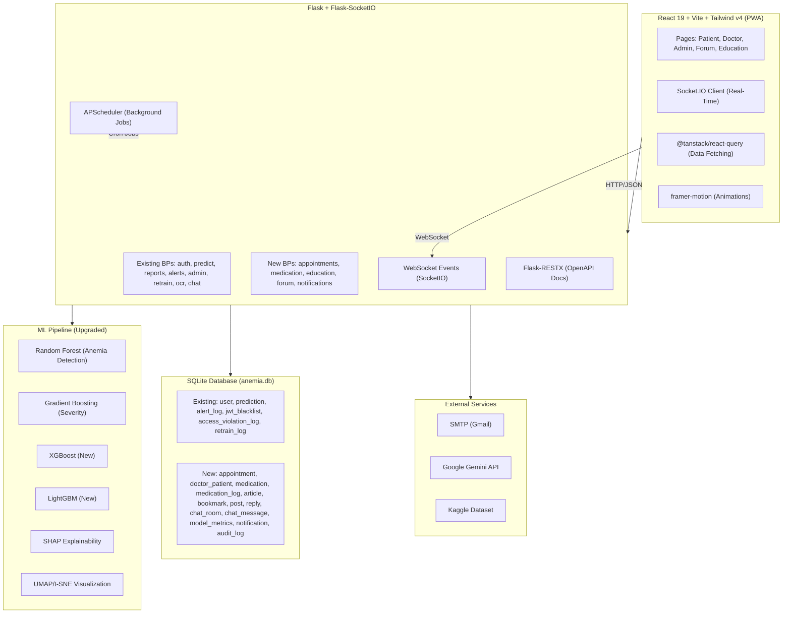
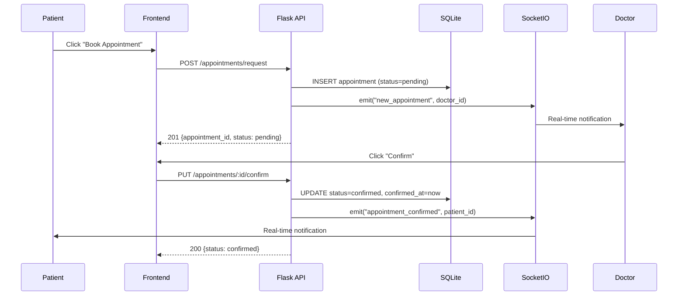
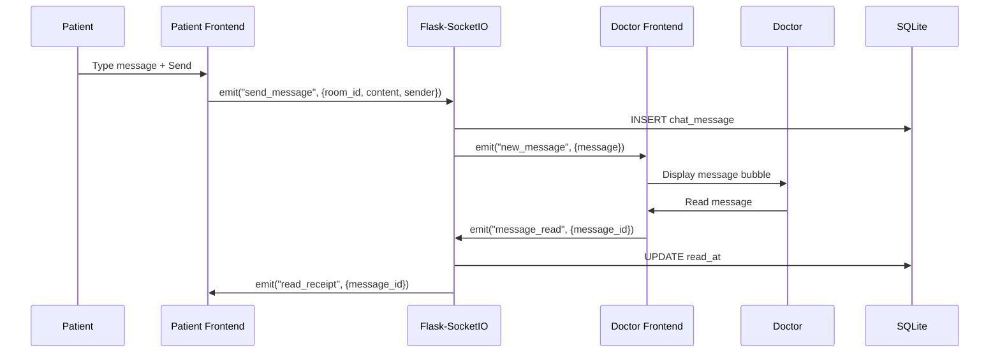
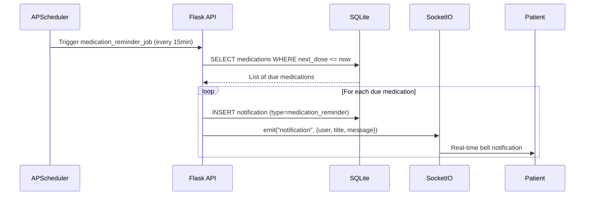
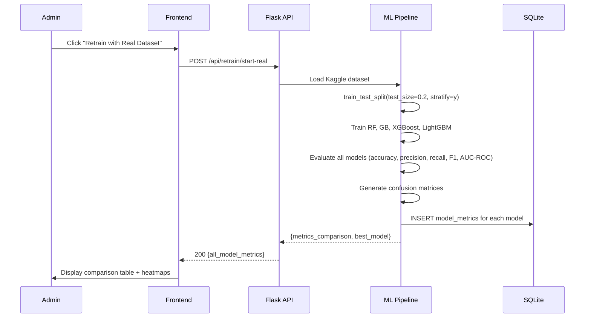

# Design Document: AnemiaCare Production Upgrade

## Overview

The AnemiaCare Production Upgrade transforms the existing Flask/React/SQLite anemia detection system from a prototype into a production-grade clinical platform. The current system operates with isolated user silos, synthetic-only ML training data, no real-time communication, and several promised-but-undelivered modules (appointments, medication tracking, community, education).

This upgrade introduces 7 new modules (Appointment Management, Doctor-Patient Relationships with Real-Time Messaging, Medication Tracker, Education Center, Community Forum, ML Model Upgrade with Real Datasets, Smart Notifications), alongside critical architecture improvements (WebSocket support via Flask-SocketIO, enhanced JWT with refresh tokens, optional TOTP 2FA, comprehensive audit logging, APScheduler background jobs, Swagger/OpenAPI documentation, and PWA-ready frontend).

The design preserves SQLite as the database (appropriate for a college project) while adding 13 new tables, upgrading the ML pipeline to use real Kaggle datasets with XGBoost/LightGBM alongside existing models, and establishing proper doctor-patient relationship flows that connect the previously isolated user roles.

---

## Architecture



---

## Sequence Diagrams

### Appointment Booking Flow



### Doctor-Patient Real-Time Chat Flow



### Medication Reminder Flow



### ML Model Evaluation & Comparison Flow



---

## Components and Interfaces

### New Backend Blueprints

| Blueprint | File | Prefix | Key Routes |
|---|---|---|---|
| appointments_bp | `blueprints/appointments_bp.py` | `/api/appointments` | POST /request, PUT /:id/confirm, PUT /:id/cancel, GET /my |
| messaging_bp | `blueprints/messaging_bp.py` | `/api/messages` | GET /rooms, GET /rooms/:id/messages, POST /rooms/:id/upload |
| medication_bp | `blueprints/medication_bp.py` | `/api/medications` | GET /, POST /, PUT /:id, DELETE /:id, POST /:id/log, GET /adherence |
| education_bp | `blueprints/education_bp.py` | `/api/articles` | GET /, GET /:id, POST / (admin), PUT /:id (admin), POST /bookmark, DELETE /bookmark/:id |
| forum_bp | `blueprints/forum_bp.py` | `/api/forum` | GET /posts, POST /posts, GET /posts/:id, POST /posts/:id/reply, POST /:id/upvote, POST /replies/:id/verify |
| notifications_bp | `blueprints/notifications_bp.py` | `/api/notifications` | GET /, PUT /:id/read, PUT /read-all, GET /unread-count |

### WebSocket Events (Flask-SocketIO)

| Event | Direction | Payload | Purpose |
|---|---|---|---|
| `join_room` | Client→Server | `{room_id, token}` | Join a chat room |
| `send_message` | Client→Server | `{room_id, content, attachment_url?}` | Send chat message |
| `new_message` | Server→Client | `{message_id, sender, content, sent_at}` | Deliver message |
| `message_read` | Client→Server | `{message_id}` | Mark message as read |
| `read_receipt` | Server→Client | `{message_id, read_at}` | Confirm read |
| `notification` | Server→Client | `{notification_id, type, title, message}` | Push notification |
| `appointment_update` | Server→Client | `{appointment_id, status}` | Appointment status change |
| `typing` | Client→Server | `{room_id, is_typing}` | Typing indicator |

### Enhanced Auth Interface

```python
# Enhanced JWT with refresh tokens
class TokenPair:
    access_token: str   # 15-minute expiry
    refresh_token: str  # 7-day expiry

# TOTP 2FA (optional for doctor/admin)
class TOTPSetup:
    secret: str         # Base32-encoded secret
    qr_uri: str         # otpauth:// URI for QR code
    backup_codes: list[str]  # 10 one-time backup codes
```

### New Frontend Components

| Component | File | Purpose |
|---|---|---|
| AppointmentCalendar | `components/AppointmentCalendar.jsx` | Weekly calendar view with time slots |
| BookingModal | `components/BookingModal.jsx` | Patient appointment request form |
| DoctorSchedule | `components/DoctorSchedule.jsx` | Doctor accept/decline appointment queue |
| DoctorChat | `components/DoctorChat.jsx` | Real-time messaging with read receipts |
| MedicationTracker | `components/MedicationTracker.jsx` | Daily med schedule + check-off + adherence |
| EducationCenter | `components/EducationCenter.jsx` | Article grid with search, tags, bookmarks |
| Forum | `components/Forum.jsx` | Post list with upvotes, tags, pinned |
| PostDetail | `components/PostDetail.jsx` | Single post with replies, doctor badges |
| NewPost | `components/NewPost.jsx` | Create post form (anonymous option) |
| NotificationBell | `components/NotificationBell.jsx` | Header bell icon with unread count dropdown |
| ModelComparison | `components/ModelComparison.jsx` | Admin model metrics table + confusion matrix heatmap |
| OnboardingWizard | `components/OnboardingWizard.jsx` | Patient first-time setup flow |
| DarkModeToggle | `components/DarkModeToggle.jsx` | System-preference-aware theme switch |

---

## Data Models

### New SQLite Tables (13 additions)

```sql
-- Module 1: Appointment Management
CREATE TABLE IF NOT EXISTS appointment (
    appointment_id  INTEGER PRIMARY KEY AUTOINCREMENT,
    doctor_id       INTEGER NOT NULL REFERENCES user(user_id),
    patient_id      INTEGER NOT NULL REFERENCES user(user_id),
    requested_at    TEXT    NOT NULL DEFAULT (datetime('now')),
    confirmed_at    TEXT,
    slot_date       TEXT    NOT NULL,
    slot_time       TEXT    NOT NULL,
    status          TEXT    NOT NULL DEFAULT 'pending'
                    CHECK(status IN ('pending','confirmed','cancelled','completed')),
    notes           TEXT,
    cancel_reason   TEXT
);

-- Module 2: Doctor-Patient Relationship
CREATE TABLE IF NOT EXISTS doctor_patient (
    id          INTEGER PRIMARY KEY AUTOINCREMENT,
    doctor_id   INTEGER NOT NULL REFERENCES user(user_id),
    patient_id  INTEGER NOT NULL REFERENCES user(user_id),
    assigned_at TEXT    NOT NULL DEFAULT (datetime('now')),
    status      TEXT    NOT NULL DEFAULT 'active'
                CHECK(status IN ('active','inactive')),
    UNIQUE(doctor_id, patient_id)
);

-- Module 2: Real-Time Chat
CREATE TABLE IF NOT EXISTS chat_room (
    room_id     INTEGER PRIMARY KEY AUTOINCREMENT,
    doctor_id   INTEGER NOT NULL REFERENCES user(user_id),
    patient_id  INTEGER NOT NULL REFERENCES user(user_id),
    created_at  TEXT    NOT NULL DEFAULT (datetime('now')),
    last_message_at TEXT,
    UNIQUE(doctor_id, patient_id)
);

CREATE TABLE IF NOT EXISTS chat_message (
    message_id  INTEGER PRIMARY KEY AUTOINCREMENT,
    room_id     INTEGER NOT NULL REFERENCES chat_room(room_id),
    sender_id   INTEGER NOT NULL REFERENCES user(user_id),
    content     TEXT    NOT NULL,
    attachment_url TEXT,
    sent_at     TEXT    NOT NULL DEFAULT (datetime('now')),
    read_at     TEXT
);

-- Module 3: Medication Tracker
CREATE TABLE IF NOT EXISTS medication (
    med_id        INTEGER PRIMARY KEY AUTOINCREMENT,
    username      TEXT    NOT NULL REFERENCES user(username),
    name          TEXT    NOT NULL,
    dose_mg       REAL    NOT NULL,
    frequency     TEXT    NOT NULL CHECK(frequency IN ('daily','twice','thrice','weekly')),
    start_date    TEXT    NOT NULL,
    end_date      TEXT,
    prescribed_by TEXT,
    active        INTEGER NOT NULL DEFAULT 1,
    created_at    TEXT    NOT NULL DEFAULT (datetime('now'))
);

CREATE TABLE IF NOT EXISTS medication_log (
    log_id    INTEGER PRIMARY KEY AUTOINCREMENT,
    med_id    INTEGER NOT NULL REFERENCES medication(med_id),
    taken_at  TEXT    NOT NULL DEFAULT (datetime('now')),
    skipped   INTEGER NOT NULL DEFAULT 0,
    notes     TEXT
);

-- Module 4: Education Center
CREATE TABLE IF NOT EXISTS article (
    article_id    INTEGER PRIMARY KEY AUTOINCREMENT,
    title         TEXT    NOT NULL,
    content_md    TEXT    NOT NULL,
    tags          TEXT,           -- JSON array of tag strings
    author_id     INTEGER NOT NULL REFERENCES user(user_id),
    published_at  TEXT,
    read_time_min INTEGER,
    summary       TEXT,           -- Gemini-generated summary
    status        TEXT    NOT NULL DEFAULT 'draft'
                  CHECK(status IN ('draft','published')),
    created_at    TEXT    NOT NULL DEFAULT (datetime('now'))
);

CREATE TABLE IF NOT EXISTS bookmark (
    bookmark_id INTEGER PRIMARY KEY AUTOINCREMENT,
    username    TEXT    NOT NULL REFERENCES user(username),
    article_id  INTEGER NOT NULL REFERENCES article(article_id),
    created_at  TEXT    NOT NULL DEFAULT (datetime('now')),
    UNIQUE(username, article_id)
);

-- Module 5: Community Forum
CREATE TABLE IF NOT EXISTS post (
    post_id     INTEGER PRIMARY KEY AUTOINCREMENT,
    username    TEXT    NOT NULL REFERENCES user(username),
    title       TEXT    NOT NULL,
    body        TEXT    NOT NULL,
    tags        TEXT,           -- JSON array of tag strings
    upvotes     INTEGER NOT NULL DEFAULT 0,
    created_at  TEXT    NOT NULL DEFAULT (datetime('now')),
    anonymous   INTEGER NOT NULL DEFAULT 0,
    pinned      INTEGER NOT NULL DEFAULT 0
);

CREATE TABLE IF NOT EXISTS reply (
    reply_id           INTEGER PRIMARY KEY AUTOINCREMENT,
    post_id            INTEGER NOT NULL REFERENCES post(post_id),
    username           TEXT    NOT NULL REFERENCES user(username),
    body               TEXT    NOT NULL,
    is_doctor_verified INTEGER NOT NULL DEFAULT 0,
    upvotes            INTEGER NOT NULL DEFAULT 0,
    created_at         TEXT    NOT NULL DEFAULT (datetime('now'))
);

-- Module 6: ML Model Metrics
CREATE TABLE IF NOT EXISTS model_metrics (
    metric_id            INTEGER PRIMARY KEY AUTOINCREMENT,
    model_name           TEXT    NOT NULL,
    version              TEXT    NOT NULL,
    accuracy             REAL    NOT NULL,
    precision_score      REAL    NOT NULL,
    recall               REAL    NOT NULL,
    f1                   REAL    NOT NULL,
    auc_roc              REAL,
    confusion_matrix_json TEXT,  -- JSON 2D array
    dataset_name         TEXT    NOT NULL,
    dataset_size         INTEGER NOT NULL,
    trained_at           TEXT    NOT NULL DEFAULT (datetime('now'))
);

-- Module 7: Smart Notifications
CREATE TABLE IF NOT EXISTS notification (
    notification_id INTEGER PRIMARY KEY AUTOINCREMENT,
    username        TEXT    NOT NULL REFERENCES user(username),
    type            TEXT    NOT NULL
                    CHECK(type IN ('medication_reminder','appointment_reminder',
                                   'checkup_nudge','alert','message','forum_reply')),
    title           TEXT    NOT NULL,
    message         TEXT    NOT NULL,
    read            INTEGER NOT NULL DEFAULT 0,
    scheduled_at    TEXT,
    sent_at         TEXT    NOT NULL DEFAULT (datetime('now')),
    delivery_method TEXT    NOT NULL DEFAULT 'in_app'
                    CHECK(delivery_method IN ('in_app','email','push'))
);

-- Architecture: Audit Logging
CREATE TABLE IF NOT EXISTS audit_log (
    audit_id    INTEGER PRIMARY KEY AUTOINCREMENT,
    actor       TEXT    NOT NULL,
    action      TEXT    NOT NULL,
    target      TEXT,
    target_type TEXT,
    ip_address  TEXT,
    timestamp   TEXT    NOT NULL DEFAULT (datetime('now')),
    details_json TEXT
);
```

### Enhanced User Table (additions to existing)

```sql
-- Add columns to existing user table
ALTER TABLE user ADD COLUMN totp_secret TEXT;
ALTER TABLE user ADD COLUMN totp_enabled INTEGER NOT NULL DEFAULT 0;
ALTER TABLE user ADD COLUMN refresh_token_hash TEXT;
ALTER TABLE user ADD COLUMN profile_complete INTEGER NOT NULL DEFAULT 0;
ALTER TABLE user ADD COLUMN phone TEXT;
ALTER TABLE user ADD COLUMN bio TEXT;
ALTER TABLE user ADD COLUMN specialization TEXT;  -- For doctors
ALTER TABLE user ADD COLUMN available_slots TEXT; -- JSON for doctor availability
```

---

## Algorithmic Pseudocode

### Appointment Scheduling Algorithm

```python
def request_appointment(patient_id: int, doctor_id: int, slot_date: str, slot_time: str) -> dict:
    """
    Patient requests an appointment with a doctor.
    
    Preconditions:
        - patient_id exists in user table with role='patient' and status='active'
        - doctor_id exists in user table with role='doctor' and status='active'
        - doctor_patient relationship exists (active) between doctor_id and patient_id
        - slot_date is a future date in YYYY-MM-DD format
        - slot_time is a valid time in HH:MM format
        - No existing confirmed appointment for same doctor+slot_date+slot_time
    
    Postconditions:
        - New row in appointment table with status='pending'
        - Notification sent to doctor via WebSocket
        - Returns appointment object with appointment_id
    
    Loop Invariants: N/A (no loops)
    """
    # Step 1: Validate relationship exists
    relationship = db.query(
        "SELECT * FROM doctor_patient WHERE doctor_id=? AND patient_id=? AND status='active'",
        (doctor_id, patient_id)
    )
    if not relationship:
        raise PermissionError("No active relationship with this doctor")
    
    # Step 2: Check slot availability (no double-booking)
    conflict = db.query(
        "SELECT * FROM appointment WHERE doctor_id=? AND slot_date=? AND slot_time=? AND status='confirmed'",
        (doctor_id, slot_date, slot_time)
    )
    if conflict:
        raise ConflictError("This time slot is already booked")
    
    # Step 3: Create appointment
    appointment_id = db.insert(
        "INSERT INTO appointment (doctor_id, patient_id, slot_date, slot_time, status) VALUES (?,?,?,?,?)",
        (doctor_id, patient_id, slot_date, slot_time, 'pending')
    )
    
    # Step 4: Notify doctor in real-time
    socketio.emit('new_appointment', {
        'appointment_id': appointment_id,
        'patient_name': get_username(patient_id),
        'slot_date': slot_date,
        'slot_time': slot_time
    }, room=f"user_{doctor_id}")
    
    return {"appointment_id": appointment_id, "status": "pending"}
```

### Medication Adherence Calculation Algorithm

```python
def calculate_adherence(username: str, days: int = 7) -> dict:
    """
    Calculate medication adherence percentage over the last N days.
    
    Preconditions:
        - username exists in user table
        - days > 0
    
    Postconditions:
        - Returns adherence_pct in [0.0, 100.0]
        - Returns per-medication breakdown
        - Does not modify any database state
    
    Loop Invariants:
        - For each medication processed: total_expected >= total_taken
        - adherence_pct = (total_taken / total_expected) * 100 when total_expected > 0
    """
    cutoff_date = (datetime.now() - timedelta(days=days)).strftime("%Y-%m-%d")
    
    # Get all active medications for user
    medications = db.query(
        "SELECT * FROM medication WHERE username=? AND active=1 AND start_date<=?",
        (username, datetime.now().strftime("%Y-%m-%d"))
    )
    
    total_expected = 0
    total_taken = 0
    breakdown = []
    
    for med in medications:
        # Calculate expected doses based on frequency
        freq_map = {'daily': 1, 'twice': 2, 'thrice': 3, 'weekly': 1/7}
        expected = int(days * freq_map.get(med['frequency'], 1))
        
        # Count actual logged doses in period
        taken = db.query_scalar(
            "SELECT COUNT(*) FROM medication_log WHERE med_id=? AND taken_at>=? AND skipped=0",
            (med['med_id'], cutoff_date)
        )
        
        total_expected += expected
        total_taken += min(taken, expected)  # Cap at expected
        
        breakdown.append({
            'med_id': med['med_id'],
            'name': med['name'],
            'expected': expected,
            'taken': taken,
            'adherence_pct': round((taken / expected) * 100, 1) if expected > 0 else 0.0
        })
    
    overall_pct = round((total_taken / total_expected) * 100, 1) if total_expected > 0 else 0.0
    
    return {
        'overall_adherence_pct': overall_pct,
        'period_days': days,
        'breakdown': breakdown,
        'streak': calculate_streak(username)
    }
```

### Real-Time Message Delivery Algorithm

```python
def handle_send_message(data: dict, sender_id: int) -> None:
    """
    Process and deliver a chat message via WebSocket.
    
    Preconditions:
        - sender_id is authenticated (valid JWT in socket session)
        - data contains: room_id (int), content (str, non-empty, max 5000 chars)
        - sender_id is a member of the chat_room (either doctor_id or patient_id)
    
    Postconditions:
        - Message persisted in chat_message table
        - Message delivered to all room members via WebSocket
        - chat_room.last_message_at updated
        - Notification created for offline recipient
    
    Loop Invariants: N/A
    """
    room_id = data['room_id']
    content = data['content'].strip()
    
    # Step 1: Verify room membership
    room = db.query_one(
        "SELECT * FROM chat_room WHERE room_id=?", (room_id,)
    )
    if sender_id not in (room['doctor_id'], room['patient_id']):
        raise PermissionError("Not a member of this room")
    
    # Step 2: Persist message
    message_id = db.insert(
        "INSERT INTO chat_message (room_id, sender_id, content) VALUES (?,?,?)",
        (room_id, sender_id, content)
    )
    
    # Step 3: Update room last_message_at
    db.execute(
        "UPDATE chat_room SET last_message_at=datetime('now') WHERE room_id=?",
        (room_id,)
    )
    
    # Step 4: Broadcast to room
    message_payload = {
        'message_id': message_id,
        'sender_id': sender_id,
        'content': content,
        'sent_at': datetime.now().isoformat(),
        'read_at': None
    }
    socketio.emit('new_message', message_payload, room=f"chat_{room_id}")
    
    # Step 5: Create notification for offline recipient
    recipient_id = room['patient_id'] if sender_id == room['doctor_id'] else room['doctor_id']
    if not is_user_online(recipient_id):
        create_notification(
            username=get_username(recipient_id),
            type='message',
            title='New message',
            message=f"New message from {get_username(sender_id)}"
        )
```

### ML Model Training & Evaluation Algorithm

```python
def train_and_evaluate_all_models(dataset_path: str) -> dict:
    """
    Train RF, GB, XGBoost, LightGBM on real dataset and evaluate all.
    
    Preconditions:
        - dataset_path points to a valid CSV with columns: RBC, MCV, MCH, MCHC, RDW, TLC, PLT, HGB
        - Dataset has at least 100 rows
        - HGB column contains valid numeric values for label derivation
    
    Postconditions:
        - All 4 models trained and saved to backend/models/
        - model_metrics table populated with metrics for each model
        - Returns comparison dict with all metrics
        - Previous models backed up to backend/models/backup/
    
    Loop Invariants:
        - For each model trained: accuracy, precision, recall, f1 all in [0.0, 1.0]
        - confusion_matrix dimensions match number of classes
    """
    import pandas as pd
    from sklearn.model_selection import train_test_split
    from sklearn.metrics import accuracy_score, precision_score, recall_score, f1_score, roc_auc_score, confusion_matrix
    from sklearn.ensemble import RandomForestClassifier, GradientBoostingClassifier
    from xgboost import XGBClassifier
    from lightgbm import LGBMClassifier
    
    # Step 1: Load and label dataset
    df = pd.read_csv(dataset_path)
    features = ['RBC', 'MCV', 'MCH', 'MCHC', 'RDW', 'TLC', 'PLT', 'HGB']
    X = df[features]
    
    # Derive labels from HGB using WHO thresholds
    y_binary = (df['HGB'] < 12.0).astype(int)  # anemia_detected
    y_severity = df['HGB'].apply(lambda h: 
        0 if h >= 12.0 else (1 if h >= 10.0 else (2 if h >= 8.0 else 3))
    )
    
    # Step 2: Stratified split
    X_train, X_test, y_train_bin, y_test_bin = train_test_split(
        X, y_binary, test_size=0.2, stratify=y_binary, random_state=42
    )
    _, _, y_train_sev, y_test_sev = train_test_split(
        X, y_severity, test_size=0.2, stratify=y_severity, random_state=42
    )
    
    # Step 3: Train all models
    models = {
        'RandomForest': RandomForestClassifier(n_estimators=100, random_state=42),
        'GradientBoosting': GradientBoostingClassifier(n_estimators=100, random_state=42),
        'XGBoost': XGBClassifier(n_estimators=100, random_state=42, eval_metric='logloss'),
        'LightGBM': LGBMClassifier(n_estimators=100, random_state=42, verbose=-1),
    }
    
    results = {}
    for name, model in models.items():
        model.fit(X_train, y_train_bin)
        y_pred = model.predict(X_test)
        y_proba = model.predict_proba(X_test)[:, 1]
        
        metrics = {
            'accuracy': accuracy_score(y_test_bin, y_pred),
            'precision': precision_score(y_test_bin, y_pred, zero_division=0),
            'recall': recall_score(y_test_bin, y_pred, zero_division=0),
            'f1': f1_score(y_test_bin, y_pred, zero_division=0),
            'auc_roc': roc_auc_score(y_test_bin, y_proba),
            'confusion_matrix': confusion_matrix(y_test_bin, y_pred).tolist(),
        }
        results[name] = metrics
        
        # Persist to model_metrics table
        db.insert(
            "INSERT INTO model_metrics (model_name, version, accuracy, precision_score, recall, f1, auc_roc, confusion_matrix_json, dataset_name, dataset_size) VALUES (?,?,?,?,?,?,?,?,?,?)",
            (name, 'v2.0', metrics['accuracy'], metrics['precision'], metrics['recall'],
             metrics['f1'], metrics['auc_roc'], json.dumps(metrics['confusion_matrix']),
             'kaggle_anemia', len(df))
        )
    
    return results
```

### Smart Notification Scheduler Algorithm

```python
def run_notification_scheduler() -> None:
    """
    Background job that checks and sends due notifications.
    Runs every 15 minutes via APScheduler.
    
    Preconditions:
        - APScheduler is running and connected to Flask app context
        - Database is accessible
    
    Postconditions:
        - All due medication reminders created and delivered
        - All 24h-before appointment reminders created and delivered
        - All 30-day checkup nudges created for eligible patients
        - No duplicate notifications for same event
    
    Loop Invariants:
        - Each notification is created at most once per trigger event
        - sent_at is always <= current time for delivered notifications
    """
    now = datetime.now()
    
    # --- Medication Reminders ---
    # Find medications due in the next 15 minutes
    due_meds = db.query("""
        SELECT m.*, u.username FROM medication m
        JOIN user u ON m.username = u.username
        WHERE m.active = 1
        AND NOT EXISTS (
            SELECT 1 FROM notification n
            WHERE n.username = m.username
            AND n.type = 'medication_reminder'
            AND n.title LIKE '%' || m.name || '%'
            AND n.sent_at >= datetime('now', '-1 hour')
        )
    """)
    
    for med in due_meds:
        if is_dose_due(med, now):
            create_and_deliver_notification(
                username=med['username'],
                type='medication_reminder',
                title=f"Time to take {med['name']}",
                message=f"Take {med['dose_mg']}mg of {med['name']}"
            )
    
    # --- Appointment Reminders (24h before) ---
    tomorrow = (now + timedelta(hours=24)).strftime("%Y-%m-%d")
    upcoming_appointments = db.query("""
        SELECT a.*, u.username as patient_username FROM appointment a
        JOIN user u ON a.patient_id = u.user_id
        WHERE a.status = 'confirmed'
        AND a.slot_date = ?
        AND NOT EXISTS (
            SELECT 1 FROM notification n
            WHERE n.username = u.username
            AND n.type = 'appointment_reminder'
            AND n.message LIKE '%' || a.appointment_id || '%'
        )
    """, (tomorrow,))
    
    for appt in upcoming_appointments:
        create_and_deliver_notification(
            username=appt['patient_username'],
            type='appointment_reminder',
            title="Appointment Tomorrow",
            message=f"You have an appointment at {appt['slot_time']} tomorrow"
        )
    
    # --- HGB Follow-up Nudges (30 days after last test) ---
    nudge_cutoff = (now - timedelta(days=30)).strftime("%Y-%m-%d")
    patients_needing_followup = db.query("""
        SELECT username, MAX(date) as last_test FROM prediction
        WHERE anemia_detected = 1
        GROUP BY username
        HAVING MAX(date) <= ?
        AND NOT EXISTS (
            SELECT 1 FROM notification n
            WHERE n.username = prediction.username
            AND n.type = 'checkup_nudge'
            AND n.sent_at >= datetime('now', '-7 days')
        )
    """, (nudge_cutoff,))
    
    for patient in patients_needing_followup:
        create_and_deliver_notification(
            username=patient['username'],
            type='checkup_nudge',
            title="Time for a Follow-up",
            message="It's been 30 days since your last CBC test. Consider scheduling a follow-up."
        )
```

### Forum Post & Doctor Verification Algorithm

```python
def create_forum_post(username: str, title: str, body: str, tags: list[str], anonymous: bool = False) -> dict:
    """
    Create a new forum post.
    
    Preconditions:
        - username exists in user table with status='active'
        - title is non-empty, max 200 chars
        - body is non-empty, max 10000 chars
        - tags is a list of max 5 strings, each max 30 chars
    
    Postconditions:
        - New row in post table
        - Returns post object with post_id
        - If anonymous=True, username is stored but not displayed publicly
    """
    post_id = db.insert(
        "INSERT INTO post (username, title, body, tags, anonymous) VALUES (?,?,?,?,?)",
        (username, title, body, json.dumps(tags), int(anonymous))
    )
    return {"post_id": post_id, "status": "created"}


def verify_reply_as_doctor(reply_id: int, doctor_username: str) -> dict:
    """
    Mark a reply as doctor-verified (green badge).
    
    Preconditions:
        - doctor_username has role='doctor' in user table
        - reply_id exists in reply table
        - The reply was authored by doctor_username
    
    Postconditions:
        - reply.is_doctor_verified = 1
        - Returns updated reply object
    """
    reply = db.query_one("SELECT * FROM reply WHERE reply_id=?", (reply_id,))
    if reply['username'] != doctor_username:
        raise PermissionError("Only the authoring doctor can verify their own reply")
    
    db.execute(
        "UPDATE reply SET is_doctor_verified=1 WHERE reply_id=?", (reply_id,)
    )
    return {"reply_id": reply_id, "is_doctor_verified": True}
```

### Enhanced Auth: Refresh Token Flow

```python
def issue_token_pair(user: dict) -> TokenPair:
    """
    Issue access + refresh token pair.
    
    Preconditions:
        - user dict contains: user_id, username, role, status='active'
        - JWT_SECRET and REFRESH_SECRET are configured in environment
    
    Postconditions:
        - access_token expires in 15 minutes
        - refresh_token expires in 7 days
        - refresh_token_hash stored in user table
        - Both tokens contain jti (unique ID) for revocation
    """
    access_jti = str(uuid4())
    refresh_jti = str(uuid4())
    now = datetime.utcnow()
    
    access_token = jwt.encode({
        'sub': user['username'],
        'role': user['role'],
        'user_id': user['user_id'],
        'jti': access_jti,
        'iat': now,
        'exp': now + timedelta(minutes=15),
        'type': 'access'
    }, os.getenv('JWT_SECRET'), algorithm='HS256')
    
    refresh_token = jwt.encode({
        'sub': user['username'],
        'jti': refresh_jti,
        'iat': now,
        'exp': now + timedelta(days=7),
        'type': 'refresh'
    }, os.getenv('REFRESH_SECRET'), algorithm='HS256')
    
    # Store refresh token hash for validation
    refresh_hash = bcrypt.hashpw(refresh_token.encode(), bcrypt.gensalt(rounds=10))
    db.execute(
        "UPDATE user SET refresh_token_hash=? WHERE user_id=?",
        (refresh_hash.decode(), user['user_id'])
    )
    
    return TokenPair(access_token=access_token, refresh_token=refresh_token)


def refresh_access_token(refresh_token: str) -> str:
    """
    Exchange a valid refresh token for a new access token.
    
    Preconditions:
        - refresh_token is a valid JWT signed with REFRESH_SECRET
        - refresh_token is not expired
        - refresh_token jti is not in jwt_blacklist
        - refresh_token_hash in user table matches
    
    Postconditions:
        - Returns new access_token (15-min expiry)
        - Does NOT rotate refresh token (simplicity for college project)
    """
    payload = jwt.decode(refresh_token, os.getenv('REFRESH_SECRET'), algorithms=['HS256'])
    
    if payload.get('type') != 'refresh':
        raise AuthError("Invalid token type")
    
    # Check blacklist
    if is_token_blacklisted(payload['jti']):
        raise AuthError("Token revoked")
    
    # Verify user still active
    user = db.query_one("SELECT * FROM user WHERE username=?", (payload['sub'],))
    if not user or user['status'] != 'active':
        raise AuthError("Account inactive")
    
    # Issue new access token
    return jwt.encode({
        'sub': user['username'],
        'role': user['role'],
        'user_id': user['user_id'],
        'jti': str(uuid4()),
        'iat': datetime.utcnow(),
        'exp': datetime.utcnow() + timedelta(minutes=15),
        'type': 'access'
    }, os.getenv('JWT_SECRET'), algorithm='HS256')
```

### Education Article Publishing with AI Summary

```python
def publish_article(article_id: int, admin_id: int) -> dict:
    """
    Publish a draft article and auto-generate summary via Gemini.
    
    Preconditions:
        - article_id exists in article table with status='draft'
        - admin_id has role='admin' in user table
        - GEMINI_API_KEY is configured in environment
    
    Postconditions:
        - article.status = 'published'
        - article.published_at = current timestamp
        - article.summary populated with Gemini-generated summary (max 200 words)
        - article.read_time_min calculated from content length
    """
    article = db.query_one("SELECT * FROM article WHERE article_id=?", (article_id,))
    if article['status'] != 'draft':
        raise ValueError("Article is already published")
    
    content = article['content_md']
    
    # Calculate read time (avg 200 words/min)
    word_count = len(content.split())
    read_time_min = max(1, round(word_count / 200))
    
    # Generate summary via Gemini
    try:
        import google.generativeai as genai
        genai.configure(api_key=os.getenv('GEMINI_API_KEY'))
        model = genai.GenerativeModel('gemini-pro')
        response = model.generate_content(
            f"Summarize this health article in 2-3 sentences (max 200 words):\n\n{content}"
        )
        summary = response.text[:500]  # Safety cap
    except Exception:
        summary = content[:200] + "..."  # Fallback to truncation
    
    # Update article
    db.execute("""
        UPDATE article SET status='published', published_at=datetime('now'),
        summary=?, read_time_min=? WHERE article_id=?
    """, (summary, read_time_min, article_id))
    
    return {"article_id": article_id, "status": "published", "summary": summary}
```

---

## Key Functions with Formal Specifications

### Function: assign_doctor_to_patient()

```python
def assign_doctor_to_patient(doctor_id: int, patient_id: int) -> dict:
    pass
```

**Preconditions:**
- `doctor_id` exists in user table with `role='doctor'` and `status='active'`
- `patient_id` exists in user table with `role='patient'` and `status='active'`
- No existing active relationship between this doctor-patient pair

**Postconditions:**
- New row in `doctor_patient` table with `status='active'`
- New row in `chat_room` table for this pair (auto-created)
- Returns relationship object with id
- Patient can now book appointments with this doctor

**Loop Invariants:** N/A

---

### Function: get_unread_notification_count()

```python
def get_unread_notification_count(username: str) -> int:
    pass
```

**Preconditions:**
- `username` exists in user table

**Postconditions:**
- Returns integer >= 0
- Count matches `SELECT COUNT(*) FROM notification WHERE username=? AND read=0`
- Does not modify any state

---

### Function: upvote_post()

```python
def upvote_post(post_id: int, username: str) -> dict:
    pass
```

**Preconditions:**
- `post_id` exists in post table
- `username` exists in user table with `status='active'`
- User has not already upvoted this post (idempotency check)

**Postconditions:**
- `post.upvotes` incremented by 1
- Upvote record stored to prevent duplicates
- Returns updated upvote count

---

### Function: setup_totp()

```python
def setup_totp(user_id: int) -> TOTPSetup:
    pass
```

**Preconditions:**
- `user_id` exists in user table with `role` in ('doctor', 'admin')
- `totp_enabled` is currently 0 for this user

**Postconditions:**
- `totp_secret` stored (encrypted) in user table
- Returns QR URI for authenticator app scanning
- Returns 10 backup codes (hashed and stored)
- `totp_enabled` remains 0 until verification step

---

### Function: verify_totp_and_enable()

```python
def verify_totp_and_enable(user_id: int, otp_code: str) -> bool:
    pass
```

**Preconditions:**
- `user_id` has `totp_secret` set but `totp_enabled=0`
- `otp_code` is a 6-digit string

**Postconditions:**
- If code valid: `totp_enabled=1`, returns True
- If code invalid: `totp_enabled` unchanged, returns False
- Validates against current and previous time window (30s tolerance)

---

## Example Usage

```python
# Example 1: Patient books appointment with their doctor
from blueprints.appointments_bp import request_appointment

result = request_appointment(
    patient_id=5,
    doctor_id=2,
    slot_date="2025-07-15",
    slot_time="10:30"
)
# Returns: {"appointment_id": 42, "status": "pending"}

# Example 2: Doctor confirms appointment
from blueprints.appointments_bp import confirm_appointment

result = confirm_appointment(appointment_id=42, doctor_id=2)
# Returns: {"appointment_id": 42, "status": "confirmed", "confirmed_at": "2025-07-14T18:30:00"}

# Example 3: Check medication adherence
from blueprints.medication_bp import calculate_adherence

adherence = calculate_adherence(username="patient1", days=7)
# Returns: {"overall_adherence_pct": 85.7, "period_days": 7, "breakdown": [...], "streak": 5}

# Example 4: Send real-time chat message
# (via WebSocket event)
socketio.emit('send_message', {
    'room_id': 3,
    'content': 'Hi doctor, my latest HGB is 10.2. Is that improving?'
})

# Example 5: Train and compare ML models
from services.ml_trainer import train_and_evaluate_all_models

results = train_and_evaluate_all_models("data/kaggle_anemia.csv")
# Returns: {
#   "RandomForest": {"accuracy": 0.92, "f1": 0.89, ...},
#   "XGBoost": {"accuracy": 0.94, "f1": 0.91, ...},
#   "LightGBM": {"accuracy": 0.93, "f1": 0.90, ...},
#   "GradientBoosting": {"accuracy": 0.91, "f1": 0.88, ...}
# }

# Example 6: Refresh expired access token
from blueprints.auth_bp import refresh_access_token

new_access = refresh_access_token(refresh_token="eyJ...")
# Returns: "eyJ..." (new 15-min access token)
```

---

## Correctness Properties

### Module 1: Appointment Management Properties

- **P1**: ∀ appointment a: a.status ∈ {'pending', 'confirmed', 'cancelled', 'completed'}
- **P2**: ∀ appointment a: a.confirmed_at is NOT NULL ⟺ a.status = 'confirmed'
- **P3**: ∀ (doctor_id, slot_date, slot_time): COUNT(appointments WHERE status='confirmed') ≤ 1 (no double-booking)
- **P4**: ∀ appointment a: a.patient_id ≠ a.doctor_id (cannot book with self)

### Module 2: Doctor-Patient & Messaging Properties

- **P5**: ∀ chat_room r: r.doctor_id has role='doctor' AND r.patient_id has role='patient'
- **P6**: ∀ chat_message m: m.sender_id ∈ {room.doctor_id, room.patient_id} for m.room_id
- **P7**: ∀ chat_message m: m.read_at is NULL OR m.read_at >= m.sent_at
- **P8**: ∀ doctor_patient dp: dp.doctor_id ≠ dp.patient_id

### Module 3: Medication Tracker Properties

- **P9**: ∀ medication m: m.dose_mg > 0
- **P10**: ∀ medication m: m.start_date <= m.end_date (when end_date is not NULL)
- **P11**: ∀ adherence calculation: 0.0 ≤ adherence_pct ≤ 100.0
- **P12**: ∀ medication_log l: l.taken_at >= medication.start_date for l.med_id

### Module 4: Education Center Properties

- **P13**: ∀ article a: a.status='published' ⟹ a.published_at is NOT NULL
- **P14**: ∀ article a: a.read_time_min >= 1
- **P15**: ∀ bookmark b: UNIQUE(b.username, b.article_id) — no duplicate bookmarks

### Module 5: Community Forum Properties

- **P16**: ∀ post p: p.upvotes >= 0
- **P17**: ∀ reply r: r.is_doctor_verified = 1 ⟹ user(r.username).role = 'doctor'
- **P18**: ∀ post p: p.pinned = 1 ⟹ pinned by admin (audit trail exists)

### Module 6: ML Model Upgrade Properties

- **P19**: ∀ model_metrics m: 0.0 ≤ m.accuracy ≤ 1.0 AND 0.0 ≤ m.f1 ≤ 1.0
- **P20**: ∀ model_metrics m: m.dataset_size > 0
- **P21**: ∀ confusion_matrix: sum(all cells) = test_set_size
- **P22**: ∀ trained model: test accuracy > 0.70 (minimum viable threshold for real data)

### Module 7: Notification Properties

- **P23**: ∀ notification n: n.type ∈ {'medication_reminder', 'appointment_reminder', 'checkup_nudge', 'alert', 'message', 'forum_reply'}
- **P24**: ∀ notification n: n.sent_at <= current_time
- **P25**: ∀ notification n: n.read = 0 OR n.read = 1 (boolean)

### Architecture Properties

- **P26**: ∀ access_token: expiry = issued_at + 15 minutes (±5s)
- **P27**: ∀ refresh_token: expiry = issued_at + 7 days (±5s)
- **P28**: ∀ audit_log entry: actor is NOT NULL AND action is NOT NULL AND timestamp is NOT NULL
- **P29**: ∀ WebSocket connection: authenticated (valid JWT) before joining any room

---

## Error Handling

### Appointment Errors

| Scenario | HTTP Code | Error Code | Recovery |
|---|---|---|---|
| No doctor-patient relationship | 403 | `NO_RELATIONSHIP` | Patient must request assignment first |
| Slot already booked | 409 | `SLOT_CONFLICT` | Show available slots |
| Appointment not found | 404 | `APPOINTMENT_NOT_FOUND` | — |
| Cannot cancel completed appointment | 400 | `INVALID_STATUS_TRANSITION` | — |

### Messaging Errors

| Scenario | HTTP Code | Error Code | Recovery |
|---|---|---|---|
| Not a room member | 403 | `NOT_ROOM_MEMBER` | — |
| Message too long (>5000 chars) | 400 | `MESSAGE_TOO_LONG` | Truncate |
| File upload too large (>10MB) | 413 | `FILE_TOO_LARGE` | Compress and retry |
| WebSocket auth failed | — | Disconnect | Reconnect with valid token |

### Medication Errors

| Scenario | HTTP Code | Error Code | Recovery |
|---|---|---|---|
| Medication not found | 404 | `MED_NOT_FOUND` | — |
| Invalid frequency value | 400 | `INVALID_FREQUENCY` | Show valid options |
| End date before start date | 400 | `INVALID_DATE_RANGE` | Correct dates |
| Duplicate log entry (same med, same hour) | 409 | `ALREADY_LOGGED` | Ignore |

### Forum Errors

| Scenario | HTTP Code | Error Code | Recovery |
|---|---|---|---|
| Post not found | 404 | `POST_NOT_FOUND` | — |
| Title too long (>200 chars) | 400 | `TITLE_TOO_LONG` | Truncate |
| Too many tags (>5) | 400 | `TOO_MANY_TAGS` | Remove excess |
| Non-doctor attempting verify | 403 | `NOT_DOCTOR` | — |

### Auth Enhancement Errors

| Scenario | HTTP Code | Error Code | Recovery |
|---|---|---|---|
| Refresh token expired | 401 | `REFRESH_EXPIRED` | Full re-login |
| Refresh token revoked | 401 | `TOKEN_REVOKED` | Full re-login |
| Invalid TOTP code | 401 | `INVALID_TOTP` | Retry or use backup code |
| TOTP already enabled | 400 | `TOTP_ALREADY_ACTIVE` | — |

---

## Testing Strategy

### Unit Testing Approach

- **Backend**: pytest with hypothesis for property-based tests
- **Coverage target**: ≥80% line coverage across all new modules
- **Key unit test areas**:
  - Appointment status transitions (state machine)
  - Medication adherence calculation edge cases
  - Forum upvote idempotency
  - Notification deduplication logic
  - Token pair issuance and refresh flow
  - TOTP verification with time windows

### Property-Based Testing Approach

**Property Test Library**: hypothesis (Python)

| Property ID | Module | Description |
|---|---|---|
| P1-P4 | Appointments | Status constraints, no double-booking, self-booking prevention |
| P5-P8 | Messaging | Room membership, message ordering, read receipt timing |
| P9-P12 | Medication | Dose positivity, date ordering, adherence bounds |
| P13-P15 | Education | Publish state consistency, read time minimum, bookmark uniqueness |
| P16-P18 | Forum | Upvote non-negativity, doctor verification integrity |
| P19-P22 | ML | Metric bounds, dataset size, confusion matrix sum |
| P23-P25 | Notifications | Type enum, timestamp ordering, boolean read state |
| P26-P29 | Architecture | Token expiry, audit completeness, WebSocket auth |

### Integration Testing Approach

- **End-to-end flows**: Appointment booking → confirmation → completion
- **WebSocket testing**: Socket.IO test client for real-time message delivery
- **ML pipeline**: Full train → evaluate → compare → deploy cycle
- **Scheduler testing**: Mock time advancement for notification triggers
- **Auth flow**: Access token expiry → refresh → new access token

### Frontend Testing

- **Framework**: Vitest + React Testing Library
- **Key test areas**:
  - AppointmentCalendar renders correct week view
  - MedicationTracker check-off updates state
  - NotificationBell shows correct unread count
  - Forum post list pagination
  - DoctorChat message bubble rendering
  - Dark mode toggle persists preference

---

## Performance Considerations

