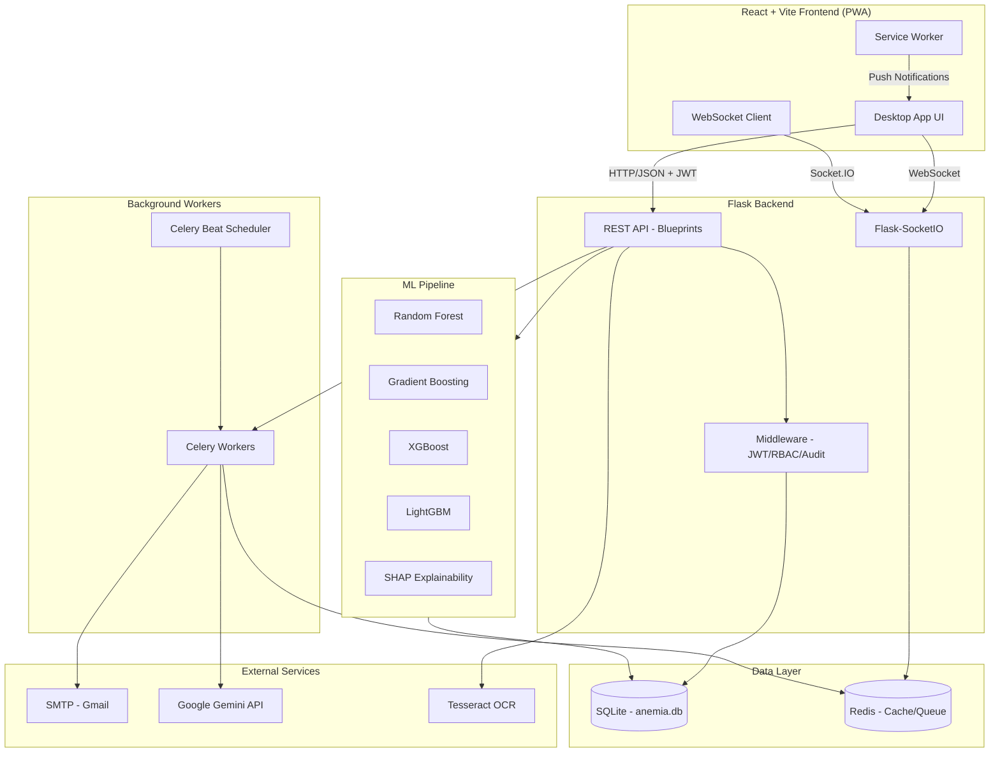
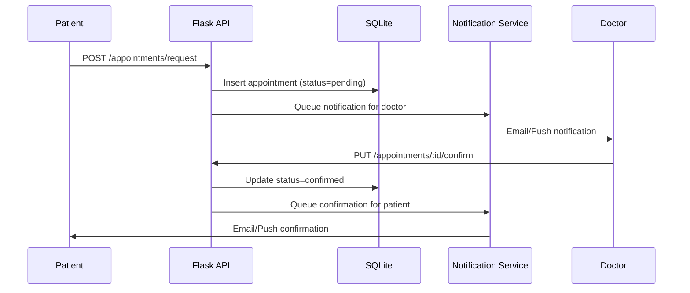
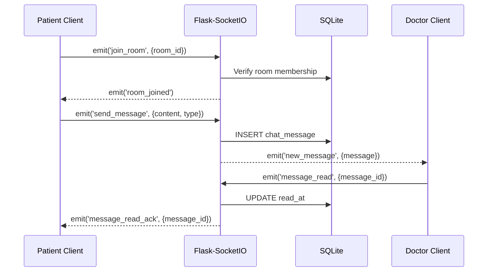
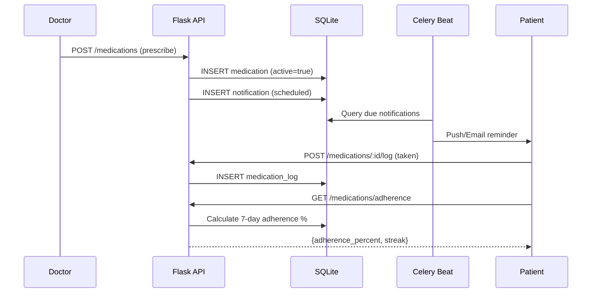
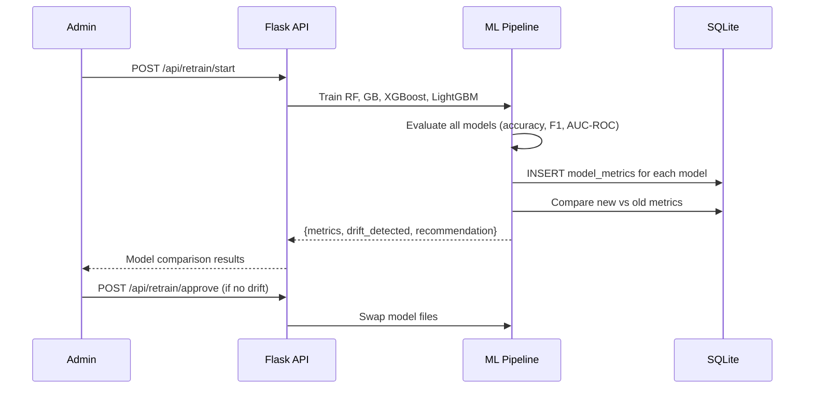
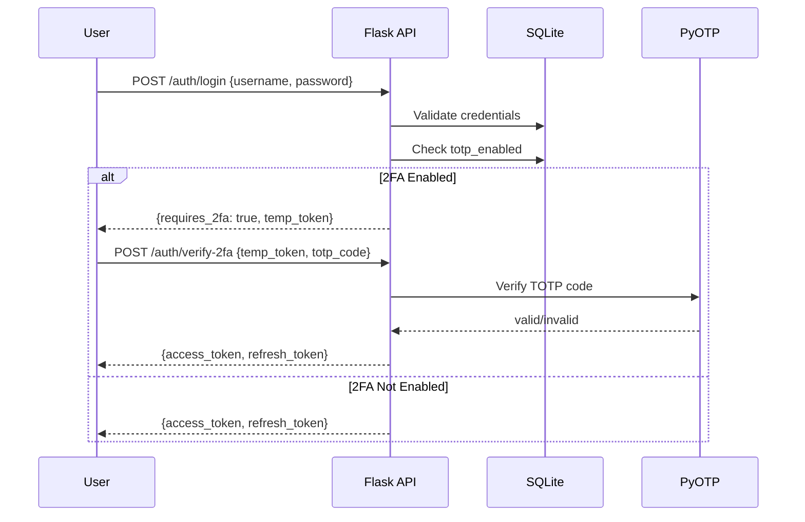
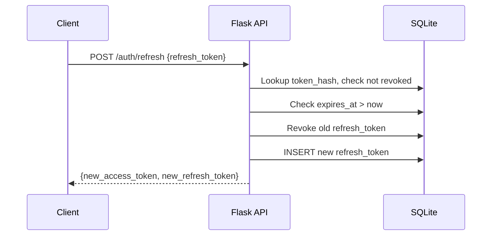
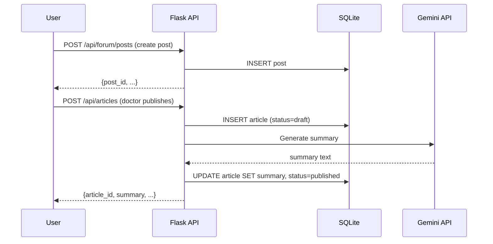
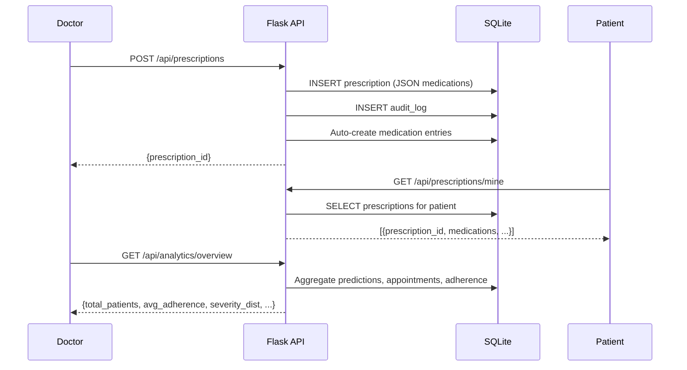
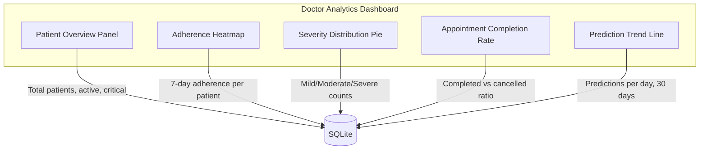

# Design Document: AnemiaCare Production Expansion

## Overview

The AnemiaCare Production Expansion transforms the existing Anemia Detection and Management System (ADMS) from a college-project prototype into a production-grade clinical platform. This expansion adds 12 major modules: Appointment Booking, Medication Tracker, Real-Time Messaging (WebSocket), Community Forum, Education Center, ML Model Upgrades (real dataset + XGBoost/LightGBM), Smart Reminders (Celery + Redis), Prescription Module, Advanced Analytics Dashboard, Backend Architecture Improvements (2FA, OpenAPI, audit logging), Frontend UX Improvements (PWA, dark mode, accessibility), and Profile/Settings Enhancement.

The design integrates with the existing Flask blueprint architecture, SQLite database, JWT/RBAC middleware, and React + Vite + Tailwind frontend. New modules follow the same patterns: Flask blueprints for API routes, service modules for business logic, and React components with the existing dark-sidebar desktop-app UI aesthetic.

Key architectural additions include Flask-SocketIO for WebSocket support (real-time chat, live notifications), Celery + Redis for background task scheduling (reminders, report generation, model retraining), and XGBoost/LightGBM alongside existing RF/GB models with formal evaluation metrics.

## Architecture

### System Architecture (Expanded)



### Data Flow — Appointment Booking



### Data Flow — Real-Time Messaging



### Data Flow — Medication Tracking & Reminders



### Data Flow — ML Model Evaluation & Drift Detection



### Data Flow — 2FA Authentication



### Data Flow — Refresh Token Rotation



### Data Flow — Forum & Education



### Data Flow — Prescription & Analytics



## Components and Interfaces

### New Backend Blueprints

| Blueprint | File | Prefix | Purpose |
|---|---|---|---|
| appointments_bp | `blueprints/appointments_bp.py` | `/api/appointments` | Appointment CRUD, calendar view |
| medication_bp | `blueprints/medication_bp.py` | `/api/medications` | Medication CRUD, adherence tracking |
| forum_bp | `blueprints/forum_bp.py` | `/api/forum` | Posts, replies, upvotes |
| education_bp | `blueprints/education_bp.py` | `/api/articles` | Article CRUD, bookmarks |
| notifications_bp | `blueprints/notifications_bp.py` | `/api/notifications` | Notification management |
| prescriptions_bp | `blueprints/prescriptions_bp.py` | `/api/prescriptions` | Prescription CRUD, PDF export |
| analytics_bp | `blueprints/analytics_bp.py` | `/api/analytics` | Advanced analytics endpoints |
| profile_bp | `blueprints/profile_bp.py` | `/api/profile` | Profile & settings management |

### New Backend Services

| Service | File | Purpose |
|---|---|---|
| appointment_service | `services/appointment_service.py` | Slot validation, conflict detection |
| medication_service | `services/medication_service.py` | Adherence calculation, schedule generation |
| notification_service | `services/notification_service.py` | Push/email delivery, scheduling |
| forum_service | `services/forum_service.py` | Post ranking, tag management |
| education_service | `services/education_service.py` | Article search, summary generation |
| model_evaluation_service | `services/model_evaluation_service.py` | Metrics computation, drift detection |
| websocket_service | `services/websocket_service.py` | SocketIO event handlers |
| analytics_service | `services/analytics_service.py` | Aggregation queries, trend computation |
| profile_service | `services/profile_service.py` | Profile CRUD, preference management |
| totp_service | `services/totp_service.py` | 2FA setup, verification, recovery |
| audit_service | `services/audit_service.py` | Audit log creation, querying |

### New Frontend Components

| Component | File | Purpose |
|---|---|---|
| AppointmentCalendar | `components/AppointmentCalendar.jsx` | Weekly calendar view |
| BookingModal | `components/BookingModal.jsx` | Patient appointment request |
| DoctorSchedule | `components/DoctorSchedule.jsx` | Doctor accept/decline view |
| MedicationTracker | `components/MedicationTracker.jsx` | Daily med schedule + check-off |
| AdherenceChart | `components/AdherenceChart.jsx` | 7/30 day adherence visualization |
| DoctorChat | `components/DoctorChat.jsx` | WebSocket chat interface |
| ChatRoomList | `components/ChatRoomList.jsx` | List of active conversations |
| Forum | `components/Forum.jsx` | Post list with filters |
| PostDetail | `components/PostDetail.jsx` | Post + replies view |
| CreatePost | `components/CreatePost.jsx` | New post form |
| EducationCenter | `components/EducationCenter.jsx` | Article grid + search |
| ArticleReader | `components/ArticleReader.jsx` | Full article view with bookmark |
| PrescriptionView | `components/PrescriptionView.jsx` | Prescription display + PDF |
| PrescriptionForm | `components/PrescriptionForm.jsx` | Doctor prescription creation |
| AnalyticsDashboard | `components/AnalyticsDashboard.jsx` | Admin/Doctor charts + metrics |
| ModelComparison | `components/ModelComparison.jsx` | Model metrics table + heatmap |
| NotificationBell | `components/NotificationBell.jsx` | Header notification dropdown |
| NotificationCenter | `components/NotificationCenter.jsx` | Full notification list page |
| OnboardingWizard | `components/OnboardingWizard.jsx` | Multi-step new patient flow |
| ProfileSettings | `components/ProfileSettings.jsx` | Health profile + preferences |
| TwoFactorSetup | `components/TwoFactorSetup.jsx` | 2FA QR code + verification |
| DarkModeToggle | `components/DarkModeToggle.jsx` | Theme switcher |
| LoadingSkeleton | `components/LoadingSkeleton.jsx` | Reusable skeleton loader |
| AccessibilityPanel | `components/AccessibilityPanel.jsx` | Font size, contrast controls |

### Frontend Component Hierarchy & State Management

```
App.jsx
├── ThemeProvider (dark/light mode context)
├── AuthProvider (JWT + refresh token context)
├── QueryClientProvider (@tanstack/react-query)
├── SocketProvider (socket.io-client context)
├── NotificationProvider (real-time notification state)
│
├── PublicRoutes
│   ├── LoginPage (with 2FA step)
│   ├── RegisterPage (OTP flow)
│   └── ForgotPasswordPage
│
├── PrivateRoutes (wrapped in PrivateRoute guard)
│   ├── PatientDashboard
│   │   ├── Sidebar (nav items)
│   │   ├── NotificationBell
│   │   ├── CBCForm + PredictionResult
│   │   ├── ReportHistory
│   │   ├── HbTrendChart
│   │   ├── AppointmentCalendar
│   │   ├── MedicationTracker + AdherenceChart
│   │   ├── DoctorChat
│   │   ├── Forum
│   │   ├── EducationCenter
│   │   ├── PrescriptionView
│   │   └── ProfileSettings
│   │
│   ├── DoctorDashboard
│   │   ├── Sidebar (nav items)
│   │   ├── NotificationBell
│   │   ├── CBCForm + PredictionResult
│   │   ├── DoctorSchedule + AppointmentCalendar
│   │   ├── PrescriptionForm
│   │   ├── DoctorChat + ChatRoomList
│   │   ├── Forum (with verified badge)
│   │   ├── EducationCenter (publish articles)
│   │   ├── AnalyticsDashboard (own patients)
│   │   └── ProfileSettings + TwoFactorSetup
│   │
│   └── AdminDashboard
│       ├── Sidebar (nav items)
│       ├── NotificationBell
│       ├── AnalyticsDashboard (system-wide)
│       ├── ModelComparison + RetrainingPanel
│       ├── UserManagement
│       ├── AlertLog
│       ├── AuditLog
│       └── ProfileSettings + TwoFactorSetup
│
└── OnboardingWizard (shown on first login for patients)
```

### State Management Strategy

| Concern | Solution | Rationale |
|---|---|---|
| Server state (API data) | @tanstack/react-query | Automatic caching, refetching, optimistic updates |
| Auth state | React Context + localStorage | JWT + refresh token persistence across tabs |
| WebSocket state | React Context (SocketProvider) | Single connection shared across components |
| Notifications | React Context + react-query | Real-time via WebSocket, historical via API |
| Theme (dark/light) | React Context + localStorage | Persisted preference, CSS variable switching |
| Form state | React Hook Form | Validation, performance, minimal re-renders |
| Accessibility prefs | React Context + localStorage | Font size, contrast, reduced motion |

### React Query Key Structure

```python
# Query key conventions for cache management
queryKeys = {
    'appointments': ['appointments', {week_start, user_id}],
    'medications': ['medications', {username}],
    'medication_schedule': ['medications', 'schedule', {date}],
    'adherence': ['medications', 'adherence', {days}],
    'chat_rooms': ['chat', 'rooms', {user_id}],
    'chat_messages': ['chat', 'messages', {room_id}],
    'forum_posts': ['forum', 'posts', {sort, page, tag}],
    'forum_post': ['forum', 'post', {post_id}],
    'articles': ['articles', {status, page, tag}],
    'article': ['articles', {article_id}],
    'notifications': ['notifications', {read, page}],
    'prescriptions': ['prescriptions', {user_id}],
    'analytics': ['analytics', {type, date_range}],
    'model_metrics': ['ml', 'metrics', {model_name}],
    'profile': ['profile', {username}],
}
```

## Data Models

### New Database Tables (SQLite DDL)

```sql
-- 1. Appointment System
CREATE TABLE IF NOT EXISTS doctor_patient (
    id          INTEGER PRIMARY KEY AUTOINCREMENT,
    doctor_id   INTEGER NOT NULL REFERENCES user(user_id),
    patient_id  INTEGER NOT NULL REFERENCES user(user_id),
    assigned_at TEXT    NOT NULL DEFAULT (datetime('now')),
    UNIQUE(doctor_id, patient_id)
);

CREATE TABLE IF NOT EXISTS appointment (
    appointment_id  INTEGER PRIMARY KEY AUTOINCREMENT,
    doctor_id       INTEGER NOT NULL REFERENCES user(user_id),
    patient_id      INTEGER NOT NULL REFERENCES user(user_id),
    requested_at    TEXT    NOT NULL DEFAULT (datetime('now')),
    confirmed_at    TEXT,
    slot_date       TEXT    NOT NULL,  -- YYYY-MM-DD
    slot_time       TEXT    NOT NULL,  -- HH:MM (24h)
    duration_min    INTEGER NOT NULL DEFAULT 30,
    status          TEXT    NOT NULL DEFAULT 'pending'
                    CHECK(status IN ('pending','confirmed','cancelled','completed')),
    notes           TEXT,
    cancellation_reason TEXT
);

-- 2. Medication Tracker
CREATE TABLE IF NOT EXISTS medication (
    med_id        INTEGER PRIMARY KEY AUTOINCREMENT,
    username      TEXT    NOT NULL REFERENCES user(username),
    name          TEXT    NOT NULL,
    dose_mg       REAL    NOT NULL,
    frequency     TEXT    NOT NULL CHECK(frequency IN ('daily','twice','thrice','weekly')),
    start_date    TEXT    NOT NULL,
    end_date      TEXT,
    prescribed_by TEXT    REFERENCES user(username),
    active        INTEGER NOT NULL DEFAULT 1,
    created_at    TEXT    NOT NULL DEFAULT (datetime('now'))
);

CREATE TABLE IF NOT EXISTS medication_log (
    log_id    INTEGER PRIMARY KEY AUTOINCREMENT,
    med_id    INTEGER NOT NULL REFERENCES medication(med_id),
    taken_at  TEXT    NOT NULL DEFAULT (datetime('now')),
    skipped   INTEGER NOT NULL DEFAULT 0,
    notes     TEXT
);

-- 3. Real-Time Messaging
CREATE TABLE IF NOT EXISTS chat_room (
    room_id         INTEGER PRIMARY KEY AUTOINCREMENT,
    doctor_id       INTEGER NOT NULL REFERENCES user(user_id),
    patient_id      INTEGER NOT NULL REFERENCES user(user_id),
    created_at      TEXT    NOT NULL DEFAULT (datetime('now')),
    last_message_at TEXT,
    UNIQUE(doctor_id, patient_id)
);

CREATE TABLE IF NOT EXISTS chat_message (
    message_id      INTEGER PRIMARY KEY AUTOINCREMENT,
    room_id         INTEGER NOT NULL REFERENCES chat_room(room_id),
    sender_username TEXT    NOT NULL,
    content         TEXT    NOT NULL,
    message_type    TEXT    NOT NULL DEFAULT 'text'
                    CHECK(message_type IN ('text','file','image')),
    file_url        TEXT,
    read_at         TEXT,
    created_at      TEXT    NOT NULL DEFAULT (datetime('now'))
);
```

```sql
-- 4. Community Forum
CREATE TABLE IF NOT EXISTS post (
    post_id    INTEGER PRIMARY KEY AUTOINCREMENT,
    username   TEXT    NOT NULL REFERENCES user(username),
    title      TEXT    NOT NULL,
    body       TEXT    NOT NULL,
    tags       TEXT,           -- JSON array of tag strings
    upvotes    INTEGER NOT NULL DEFAULT 0,
    created_at TEXT    NOT NULL DEFAULT (datetime('now')),
    anonymous  INTEGER NOT NULL DEFAULT 0,
    pinned     INTEGER NOT NULL DEFAULT 0
);

CREATE TABLE IF NOT EXISTS reply (
    reply_id           INTEGER PRIMARY KEY AUTOINCREMENT,
    post_id            INTEGER NOT NULL REFERENCES post(post_id),
    username           TEXT    NOT NULL REFERENCES user(username),
    body               TEXT    NOT NULL,
    is_doctor_verified INTEGER NOT NULL DEFAULT 0,
    upvotes            INTEGER NOT NULL DEFAULT 0,
    created_at         TEXT    NOT NULL DEFAULT (datetime('now'))
);

CREATE TABLE IF NOT EXISTS post_upvote (
    id       INTEGER PRIMARY KEY AUTOINCREMENT,
    post_id  INTEGER NOT NULL REFERENCES post(post_id),
    username TEXT    NOT NULL,
    UNIQUE(post_id, username)
);

CREATE TABLE IF NOT EXISTS reply_upvote (
    id       INTEGER PRIMARY KEY AUTOINCREMENT,
    reply_id INTEGER NOT NULL REFERENCES reply(reply_id),
    username TEXT    NOT NULL,
    UNIQUE(reply_id, username)
);

-- 5. Education Center
CREATE TABLE IF NOT EXISTS article (
    article_id    INTEGER PRIMARY KEY AUTOINCREMENT,
    title         TEXT    NOT NULL,
    content_md    TEXT    NOT NULL,
    summary       TEXT,
    tags          TEXT,           -- JSON array
    author_id     TEXT    NOT NULL REFERENCES user(username),
    published_at  TEXT,
    read_time_min INTEGER,
    status        TEXT    NOT NULL DEFAULT 'draft'
                  CHECK(status IN ('draft','published'))
);

CREATE TABLE IF NOT EXISTS bookmark (
    bookmark_id INTEGER PRIMARY KEY AUTOINCREMENT,
    username    TEXT    NOT NULL REFERENCES user(username),
    article_id  INTEGER NOT NULL REFERENCES article(article_id),
    created_at  TEXT    NOT NULL DEFAULT (datetime('now')),
    UNIQUE(username, article_id)
);

-- 6. ML Model Metrics
CREATE TABLE IF NOT EXISTS model_metrics (
    metric_id        INTEGER PRIMARY KEY AUTOINCREMENT,
    model_name       TEXT    NOT NULL,
    accuracy         REAL    NOT NULL,
    precision_score  REAL    NOT NULL,
    recall           REAL    NOT NULL,
    f1_score         REAL    NOT NULL,
    auc_roc          REAL,
    confusion_matrix TEXT,   -- JSON 2D array
    dataset_name     TEXT    NOT NULL,
    dataset_size     INTEGER NOT NULL,
    trained_at       TEXT    NOT NULL DEFAULT (datetime('now'))
);
```

```sql
-- 7. Smart Reminders / Notifications
CREATE TABLE IF NOT EXISTS notification (
    notification_id  INTEGER PRIMARY KEY AUTOINCREMENT,
    username         TEXT    NOT NULL REFERENCES user(username),
    type             TEXT    NOT NULL
                     CHECK(type IN ('medication','appointment','checkup','alert','forum','system')),
    title            TEXT    NOT NULL,
    message          TEXT    NOT NULL,
    read             INTEGER NOT NULL DEFAULT 0,
    scheduled_at     TEXT,
    sent_at          TEXT,
    delivery_method  TEXT    NOT NULL DEFAULT 'push'
                     CHECK(delivery_method IN ('push','email','both')),
    created_at       TEXT    NOT NULL DEFAULT (datetime('now'))
);

-- 8. Prescription Module
CREATE TABLE IF NOT EXISTS prescription (
    prescription_id    INTEGER PRIMARY KEY AUTOINCREMENT,
    doctor_id          TEXT    NOT NULL REFERENCES user(username),
    patient_id         TEXT    NOT NULL REFERENCES user(username),
    prediction_id      INTEGER REFERENCES prediction(prediction_id),
    medications        TEXT    NOT NULL,  -- JSON array [{name, dose, frequency, duration}]
    dosage_instructions TEXT,
    duration_days      INTEGER,
    follow_up_date     TEXT,
    notes              TEXT,
    created_at         TEXT    NOT NULL DEFAULT (datetime('now'))
);

-- 9. Audit Log (comprehensive)
CREATE TABLE IF NOT EXISTS audit_log (
    audit_id    INTEGER PRIMARY KEY AUTOINCREMENT,
    actor       TEXT    NOT NULL,
    action      TEXT    NOT NULL,
    target      TEXT,
    details     TEXT,   -- JSON
    ip_address  TEXT,
    timestamp   TEXT    NOT NULL DEFAULT (datetime('now'))
);

-- 10. User Profile Extension (add columns to existing user table)
-- ALTER TABLE user ADD COLUMN blood_type TEXT;
-- ALTER TABLE user ADD COLUMN known_conditions TEXT;  -- JSON array
-- ALTER TABLE user ADD COLUMN dietary_preferences TEXT;  -- JSON array
-- ALTER TABLE user ADD COLUMN emergency_contact TEXT;  -- JSON {name, phone, relation}
-- ALTER TABLE user ADD COLUMN specialization TEXT;  -- doctor only
-- ALTER TABLE user ADD COLUMN license_number TEXT;  -- doctor only
-- ALTER TABLE user ADD COLUMN available_hours TEXT;  -- JSON {mon: {start, end}, ...}
-- ALTER TABLE user ADD COLUMN notification_prefs TEXT;  -- JSON {email, push, sms}
-- ALTER TABLE user ADD COLUMN totp_secret TEXT;  -- 2FA secret
-- ALTER TABLE user ADD COLUMN totp_enabled INTEGER DEFAULT 0;
-- ALTER TABLE user ADD COLUMN theme_pref TEXT DEFAULT 'light';
-- ALTER TABLE user ADD COLUMN font_size TEXT DEFAULT 'medium';
-- ALTER TABLE user ADD COLUMN high_contrast INTEGER DEFAULT 0;
-- ALTER TABLE user ADD COLUMN onboarding_complete INTEGER DEFAULT 0;

-- 11. Refresh Token table
CREATE TABLE IF NOT EXISTS refresh_token (
    token_id   INTEGER PRIMARY KEY AUTOINCREMENT,
    username   TEXT    NOT NULL REFERENCES user(username),
    token_hash TEXT    NOT NULL UNIQUE,
    expires_at TEXT    NOT NULL,
    created_at TEXT    NOT NULL DEFAULT (datetime('now')),
    revoked    INTEGER NOT NULL DEFAULT 0
);
```

## API Endpoint Specifications

### Appointments Blueprint (`/api/appointments`)

| Method | Endpoint | Auth | Roles | Request Body | Response |
|---|---|---|---|---|---|
| POST | `/request` | JWT | patient | `{doctor_id, slot_date, slot_time, notes?}` | `{appointment_id, status: "pending"}` |
| GET | `/calendar` | JWT | patient, doctor | Query: `week_start` (YYYY-MM-DD) | `[{appointment_id, doctor_name/patient_name, slot_date, slot_time, status}]` |
| GET | `/:id` | JWT | patient, doctor | — | `{appointment_id, doctor_name, patient_name, slot_date, slot_time, status, notes}` |
| PUT | `/:id/confirm` | JWT | doctor | — | `{appointment_id, status: "confirmed", confirmed_at}` |
| PUT | `/:id/cancel` | JWT | patient, doctor | `{reason?}` | `{appointment_id, status: "cancelled"}` |
| PUT | `/:id/complete` | JWT | doctor | — | `{appointment_id, status: "completed"}` |
| GET | `/available-slots` | JWT | patient | Query: `doctor_id, date` | `[{time: "HH:MM", available: bool}]` |

### Medications Blueprint (`/api/medications`)

| Method | Endpoint | Auth | Roles | Request Body | Response |
|---|---|---|---|---|---|
| POST | `/` | JWT | doctor | `{patient_username, name, dose_mg, frequency, start_date, end_date?}` | `{med_id, ...}` |
| GET | `/` | JWT | patient, doctor | Query: `active=1` | `[{med_id, name, dose_mg, frequency, ...}]` |
| GET | `/schedule` | JWT | patient | Query: `date?` (default today) | `[{med_id, name, dose_mg, taken, taken_at}]` |
| POST | `/:id/log` | JWT | patient | `{skipped?, notes?}` | `{log_id, taken_at}` |
| GET | `/adherence` | JWT | patient, doctor | Query: `days=7` | `{adherence_percent, total_doses, taken_doses, streak}` |
| PUT | `/:id/deactivate` | JWT | doctor | — | `{med_id, active: 0}` |
| GET | `/history` | JWT | patient | Query: `med_id, page` | `[{log_id, taken_at, skipped, notes}]` |

### Forum Blueprint (`/api/forum`)

| Method | Endpoint | Auth | Roles | Request Body | Response |
|---|---|---|---|---|---|
| GET | `/posts` | JWT | all | Query: `sort=hot/top/new, page, tag?` | `{posts: [...], total, page}` |
| POST | `/posts` | JWT | all | `{title, body, tags?, anonymous?}` | `{post_id, ...}` |
| GET | `/posts/:id` | JWT | all | — | `{post_id, title, body, replies: [...], upvotes}` |
| POST | `/posts/:id/replies` | JWT | all | `{body}` | `{reply_id, ...}` |
| POST | `/posts/:id/upvote` | JWT | all | — | `{upvoted: bool, total_upvotes}` |
| POST | `/replies/:id/upvote` | JWT | all | — | `{upvoted: bool, total_upvotes}` |
| PUT | `/replies/:id/verify` | JWT | doctor | — | `{reply_id, is_doctor_verified: 1}` |
| DELETE | `/posts/:id` | JWT | author, admin | — | `{deleted: true}` |
| GET | `/tags` | JWT | all | — | `[{tag, count}]` |

### Education Blueprint (`/api/articles`)

| Method | Endpoint | Auth | Roles | Request Body | Response |
|---|---|---|---|---|---|
| GET | `/` | JWT | all | Query: `status, page, tag?, search?` | `{articles: [...], total, page}` |
| POST | `/` | JWT | doctor, admin | `{title, content_md, tags?}` | `{article_id, read_time_min, summary}` |
| GET | `/:id` | JWT | all | — | `{article_id, title, content_md, summary, author, ...}` |
| PUT | `/:id` | JWT | author | `{title?, content_md?, tags?}` | `{article_id, ...}` |
| POST | `/:id/publish` | JWT | author | — | `{article_id, status: "published", published_at}` |
| POST | `/:id/bookmark` | JWT | all | — | `{bookmarked: bool}` |
| GET | `/bookmarks` | JWT | all | — | `[{article_id, title, ...}]` |

### Notifications Blueprint (`/api/notifications`)

| Method | Endpoint | Auth | Roles | Request Body | Response |
|---|---|---|---|---|---|
| GET | `/` | JWT | all | Query: `read=0/1, page, type?` | `{notifications: [...], unread_count, total}` |
| GET | `/unread-count` | JWT | all | — | `{count: int}` |
| PUT | `/:id/read` | JWT | all | — | `{notification_id, read: 1}` |
| PUT | `/read-all` | JWT | all | — | `{updated_count: int}` |
| DELETE | `/:id` | JWT | all | — | `{deleted: true}` |

### Prescriptions Blueprint (`/api/prescriptions`)

| Method | Endpoint | Auth | Roles | Request Body | Response |
|---|---|---|---|---|---|
| POST | `/` | JWT | doctor | `{patient_username, prediction_id?, medications, dosage_instructions?, duration_days, follow_up_date?, notes?}` | `{prescription_id, ...}` |
| GET | `/` | JWT | doctor | Query: `patient_username?, page` | `[{prescription_id, patient, medications, created_at}]` |
| GET | `/mine` | JWT | patient | Query: `page` | `[{prescription_id, doctor, medications, created_at}]` |
| GET | `/:id` | JWT | doctor, patient | — | `{prescription_id, medications, dosage_instructions, ...}` |
| GET | `/:id/pdf` | JWT | doctor, patient | — | PDF binary response |

### Analytics Blueprint (`/api/analytics`)

| Method | Endpoint | Auth | Roles | Request Body | Response |
|---|---|---|---|---|---|
| GET | `/overview` | JWT | doctor, admin | Query: `date_range?` | `{total_patients, total_predictions, severity_distribution, type_distribution}` |
| GET | `/trends` | JWT | doctor, admin | Query: `metric, period=30d` | `{data_points: [{date, value}]}` |
| GET | `/adherence-summary` | JWT | doctor | Query: `patient_username?` | `{avg_adherence, patients_below_80, top_adherent}` |
| GET | `/appointments-summary` | JWT | doctor, admin | Query: `period=30d` | `{total, completed, cancelled, no_show_rate}` |
| GET | `/model-performance` | JWT | admin | — | `{models: [{name, accuracy, f1, auc_roc, trained_at}]}` |
| GET | `/system-health` | JWT | admin | — | `{db_size, active_users_24h, api_latency_p95, celery_queue_depth}` |

### Profile Blueprint (`/api/profile`)

| Method | Endpoint | Auth | Roles | Request Body | Response |
|---|---|---|---|---|---|
| GET | `/` | JWT | all | — | `{username, email, role, blood_type, conditions, dietary_prefs, ...}` |
| PUT | `/` | JWT | all | `{blood_type?, known_conditions?, dietary_preferences?, emergency_contact?}` | `{updated: true}` |
| PUT | `/preferences` | JWT | all | `{theme, font_size, high_contrast, language, notification_prefs}` | `{updated: true}` |
| POST | `/2fa/setup` | JWT | doctor, admin | — | `{qr_code_url, secret, backup_codes}` |
| POST | `/2fa/verify` | JWT | doctor, admin | `{totp_code}` | `{enabled: true}` |
| DELETE | `/2fa` | JWT | doctor, admin | `{totp_code}` | `{disabled: true}` |
| PUT | `/password` | JWT | all | `{current_password, new_password}` | `{updated: true}` |
| PUT | `/available-hours` | JWT | doctor | `{hours: {mon: {start, end}, ...}}` | `{updated: true}` |

### Auth Blueprint Extensions (added to existing `/auth`)

| Method | Endpoint | Auth | Roles | Request Body | Response |
|---|---|---|---|---|---|
| POST | `/refresh` | None | all | `{refresh_token}` | `{access_token, refresh_token}` |
| POST | `/verify-2fa` | temp_token | all | `{temp_token, totp_code}` | `{access_token, refresh_token}` |
| POST | `/revoke` | JWT | all | `{refresh_token}` | `{revoked: true}` |

## WebSocket Event Specifications

### Connection

```python
# Client connects with JWT authentication
# URL: ws://localhost:5000 (or wss:// in production)
# Auth: {token: "jwt_access_token"} passed in connection auth param
# On connect: server validates JWT, stores session mapping username -> sid
# On disconnect: server removes session mapping, emits 'user_offline' to relevant rooms
```

### Events: Client → Server

| Event | Payload | Description |
|---|---|---|
| `join_room` | `{room_id: int}` | Join a chat room (validates membership) |
| `leave_room` | `{room_id: int}` | Leave a chat room |
| `send_message` | `{room_id: int, content: str, message_type: str, file_url?: str}` | Send message to room |
| `message_read` | `{message_id: int}` | Mark a message as read |
| `typing_start` | `{room_id: int}` | Indicate user started typing |
| `typing_stop` | `{room_id: int}` | Indicate user stopped typing |
| `subscribe_notifications` | `{}` | Subscribe to real-time notification channel |

### Events: Server → Client

| Event | Payload | Description |
|---|---|---|
| `room_joined` | `{room_id: int, messages: [...last 50]}` | Confirmation + message history |
| `new_message` | `{message_id, room_id, sender, content, message_type, created_at}` | New message in room |
| `message_read_ack` | `{message_id: int, read_at: str}` | Confirmation message was read |
| `user_typing` | `{room_id: int, username: str}` | Other user is typing |
| `user_stopped_typing` | `{room_id: int, username: str}` | Other user stopped typing |
| `user_online` | `{username: str}` | User came online |
| `user_offline` | `{username: str}` | User went offline |
| `notification` | `{notification_id, type, title, message, created_at}` | Real-time notification push |
| `appointment_update` | `{appointment_id, status, ...}` | Appointment status changed |
| `error` | `{code: str, message: str}` | Error response |

### WebSocket Middleware

```python
# Authentication middleware for SocketIO
@socketio.on('connect')
def handle_connect(auth):
    """
    Validate JWT from auth param on connection.
    If invalid/expired: disconnect with error.
    Store username -> session_id mapping in Redis.
    """
    token = auth.get('token') if auth else None
    if not token:
        disconnect()
        return False
    
    payload = validate_jwt(token)
    if not payload:
        emit('error', {'code': 'AUTH_FAILED', 'message': 'Invalid token'})
        disconnect()
        return False
    
    # Store session
    session['username'] = payload['username']
    session['role'] = payload['role']
    redis.set(f"ws:user:{payload['username']}", request.sid, ex=86400)
    
    # Join personal notification room
    join_room(f"user:{payload['username']}")
```

## Key Functions with Formal Specifications

### Appointment Service

```python
def request_appointment(patient_id: int, doctor_id: int, slot_date: str, slot_time: str, notes: str | None) -> dict:
    """Create a new appointment request."""
    ...
```

**Preconditions:**
- `patient_id` exists in user table with role='patient'
- `doctor_id` exists in user table with role='doctor'
- `slot_date` is a valid ISO date string (YYYY-MM-DD) in the future
- `slot_time` is a valid 24h time string (HH:MM), within doctor's available hours
- No existing confirmed appointment for same doctor at same slot_date + slot_time

**Postconditions:**
- New row in appointment table with status='pending'
- Returns appointment dict with appointment_id
- Notification queued for doctor

```python
def confirm_appointment(appointment_id: int, doctor_username: str) -> dict:
    """Doctor confirms a pending appointment."""
    ...
```

**Preconditions:**
- `appointment_id` exists with status='pending'
- `doctor_username` matches the doctor_id on the appointment
- No conflicting confirmed appointment at same slot

**Postconditions:**
- appointment.status = 'confirmed', confirmed_at = now()
- Notification queued for patient
- Returns updated appointment dict

```python
def get_calendar_view(user_id: int, role: str, week_start: str) -> list[dict]:
    """Get weekly appointment calendar for a user."""
    ...
```

**Preconditions:**
- `user_id` exists in user table
- `week_start` is a valid Monday date (YYYY-MM-DD)

**Postconditions:**
- Returns list of appointments for the 7-day window
- Filtered by role: doctors see their appointments, patients see theirs
- Each appointment includes patient/doctor name, status, time

```python
def get_available_slots(doctor_id: int, date: str) -> list[dict]:
    """Get available time slots for a doctor on a given date."""
    ...
```

**Preconditions:**
- `doctor_id` exists with role='doctor'
- `date` is a valid ISO date (YYYY-MM-DD), today or future
- Doctor has available_hours configured for that day of week

**Postconditions:**
- Returns list of 30-minute slots within doctor's available hours
- Each slot marked as available=True/False based on existing confirmed appointments
- Slots in the past (for today) are marked unavailable

### Medication Service

```python
def calculate_adherence(username: str, days: int = 7) -> dict:
    """Calculate medication adherence percentage over N days."""
    ...
```

**Preconditions:**
- `username` exists with at least one active medication
- `days` is a positive integer (1-90)

**Postconditions:**
- Returns `{adherence_percent: float, total_doses: int, taken_doses: int, streak: int}`
- `adherence_percent` = (taken_doses / total_doses) * 100, clamped to [0, 100]
- `streak` = consecutive days with all doses taken (0 if missed today)
- Only considers active medications within their start_date..end_date window

```python
def get_todays_schedule(username: str) -> list[dict]:
    """Get today's medication schedule with taken/pending status."""
    ...
```

**Preconditions:**
- `username` exists in user table

**Postconditions:**
- Returns list of medications due today based on frequency
- Each item: `{med_id, name, dose_mg, frequency, taken: bool, taken_at: str|None}`
- 'daily' = 1 dose, 'twice' = 2 doses, 'thrice' = 3 doses, 'weekly' = 1 dose on start_day

```python
def log_medication(med_id: int, username: str, skipped: bool = False, notes: str | None = None) -> dict:
    """Log a medication as taken or skipped."""
    ...
```

**Preconditions:**
- `med_id` exists and belongs to `username`
- Medication is active and within date range
- No duplicate log for same med_id within the current dose window

**Postconditions:**
- New row in medication_log
- Returns log entry dict
- If all today's meds taken, increment streak counter

### WebSocket Event Handlers

```python
@socketio.on('join_room')
def handle_join_room(data: dict) -> None:
    """Join a chat room. data = {room_id: int}"""
    ...
```

**Preconditions:**
- Authenticated user (JWT in connection headers)
- User is a member of the room (doctor_id or patient_id matches)

**Postconditions:**
- User joins the SocketIO room
- Emits 'room_joined' to the user with room history (last 50 messages)

```python
@socketio.on('send_message')
def handle_send_message(data: dict) -> None:
    """Send a message. data = {room_id: int, content: str, message_type: str, file_url?: str}"""
    ...
```

**Preconditions:**
- User is authenticated and member of room_id
- `content` is non-empty string (max 5000 chars)
- `message_type` in ('text', 'file', 'image')
- If message_type != 'text', file_url must be provided

**Postconditions:**
- New row in chat_message table
- chat_room.last_message_at updated
- 'new_message' emitted to all room members
- Unread count incremented for recipient

### Model Evaluation Service

```python
def evaluate_model(model, X_test: np.ndarray, y_test: np.ndarray, model_name: str) -> dict:
    """Evaluate a trained model and return comprehensive metrics."""
    ...
```

**Preconditions:**
- `model` is a fitted sklearn-compatible estimator with predict() and predict_proba()
- `X_test` and `y_test` have matching first dimension
- `model_name` is a non-empty string

**Postconditions:**
- Returns `{accuracy, precision, recall, f1, auc_roc, confusion_matrix}`
- All metrics are floats in [0.0, 1.0]
- confusion_matrix is a 2D list of integers
- Metrics stored in model_metrics table

```python
def detect_drift(model_name: str, new_metrics: dict) -> dict:
    """Compare new model metrics against the last stored metrics to detect drift."""
    ...
```

**Preconditions:**
- `model_name` has at least one entry in model_metrics table
- `new_metrics` contains accuracy, f1, auc_roc keys

**Postconditions:**
- Returns `{drift_detected: bool, degradation: dict, recommendation: str}`
- `drift_detected` = True if any metric drops by > 5% relative
- `degradation` shows per-metric delta
- `recommendation` is one of: 'approve', 'review', 'reject'

```python
def train_all_models(dataset_path: str) -> dict:
    """Train RF, GB, XGBoost, LightGBM on the given dataset."""
    ...
```

**Preconditions:**
- `dataset_path` points to a valid CSV with required CBC columns + HGB
- CSV has at least 100 rows

**Postconditions:**
- Four models trained and saved to models/new/ directory
- Metrics computed for each model
- Returns dict of {model_name: metrics_dict}
- Does NOT swap active models (requires explicit approve step)

### Forum Service

```python
def create_post(username: str, title: str, body: str, tags: list[str], anonymous: bool = False) -> dict:
    """Create a new forum post."""
    ...
```

**Preconditions:**
- `username` exists and is active
- `title` is 5-200 characters
- `body` is 10-10000 characters
- `tags` is a list of 0-5 strings, each 2-30 characters

**Postconditions:**
- New row in post table
- If anonymous=True, username stored but not displayed in API responses
- Returns post dict with post_id

```python
def upvote_post(post_id: int, username: str) -> dict:
    """Toggle upvote on a post (idempotent toggle)."""
    ...
```

**Preconditions:**
- `post_id` exists in post table
- `username` exists and is active

**Postconditions:**
- If user hasn't upvoted: insert post_upvote, increment post.upvotes
- If user already upvoted: delete post_upvote, decrement post.upvotes
- Returns `{upvoted: bool, total_upvotes: int}`

### Notification Service

```python
def schedule_medication_reminders(username: str) -> int:
    """Schedule all medication reminders for a user based on their active medications."""
    ...
```

**Preconditions:**
- `username` has at least one active medication

**Postconditions:**
- Creates notification entries with scheduled_at times based on medication frequency
- Returns count of notifications scheduled
- Does not create duplicates for already-scheduled times

```python
def send_notification(notification_id: int) -> bool:
    """Deliver a notification via its configured delivery_method."""
    ...
```

**Preconditions:**
- `notification_id` exists and has not been sent (sent_at is NULL)

**Postconditions:**
- If delivery_method='email': sends email via SMTP
- If delivery_method='push': emits WebSocket event to user
- If delivery_method='both': does both
- Updates sent_at timestamp
- Returns True on success, False on failure

### Prescription Service

```python
def create_prescription(doctor_username: str, patient_username: str, prediction_id: int | None,
                       medications: list[dict], dosage_instructions: str,
                       duration_days: int, follow_up_date: str | None, notes: str | None) -> dict:
    """Create a new prescription linked to a prediction."""
    ...
```

**Preconditions:**
- `doctor_username` has role='doctor'
- `patient_username` has role='patient'
- If `prediction_id` provided, it exists and belongs to patient_username
- `medications` is a non-empty list of {name: str, dose: str, frequency: str, duration: str}
- `duration_days` is positive integer

**Postconditions:**
- New row in prescription table
- Medications stored as JSON
- Returns prescription dict with prescription_id
- Audit log entry created
- Optionally auto-creates medication entries for the patient

### Education Service

```python
def calculate_read_time(content_md: str) -> int:
    """Calculate estimated reading time in minutes."""
    ...
```

**Preconditions:**
- `content_md` is a non-empty string

**Postconditions:**
- Returns integer minutes (minimum 1)
- Calculation: word_count / 200 (average reading speed), rounded up
- Code blocks counted at 50% weight

```python
def generate_summary(content_md: str) -> str:
    """Use Gemini API to generate a 2-3 sentence summary of article content."""
    ...
```

**Preconditions:**
- `content_md` is at least 100 characters
- GEMINI_API_KEY is configured

**Postconditions:**
- Returns summary string (50-300 characters)
- If Gemini API fails, returns first 200 chars of content as fallback

### Analytics Service

```python
def get_overview_metrics(doctor_username: str | None, date_range: tuple[str, str] | None) -> dict:
    """Get aggregated metrics for analytics dashboard."""
    ...
```

**Preconditions:**
- If `doctor_username` provided, user exists with role='doctor'
- `date_range` is a tuple of (start_date, end_date) in ISO format, or None for all-time

**Postconditions:**
- Returns `{total_patients, total_predictions, severity_distribution, type_distribution, avg_adherence}`
- If doctor_username provided, scoped to that doctor's patients only
- If None (admin), returns system-wide metrics

```python
def get_trend_data(metric: str, period_days: int = 30) -> list[dict]:
    """Get time-series data for a specific metric."""
    ...
```

**Preconditions:**
- `metric` is one of: 'predictions', 'appointments', 'new_users', 'adherence'
- `period_days` is positive integer (1-365)

**Postconditions:**
- Returns list of `{date: str, value: float}` for each day in period
- Missing days filled with 0
- Data sorted by date ascending

### TOTP (2FA) Service

```python
def setup_2fa(username: str) -> dict:
    """Generate TOTP secret and QR code for 2FA setup."""
    ...
```

**Preconditions:**
- `username` exists with role='doctor' or 'admin'
- User does not already have totp_enabled=1

**Postconditions:**
- Generates 32-character base32 secret via pyotp
- Stores secret in user.totp_secret (NOT yet enabled)
- Returns `{secret, qr_code_url, backup_codes: [8 codes]}`
- QR code URL is otpauth:// URI for authenticator apps

```python
def verify_and_enable_2fa(username: str, totp_code: str) -> bool:
    """Verify TOTP code and enable 2FA for the user."""
    ...
```

**Preconditions:**
- `username` has totp_secret set but totp_enabled=0
- `totp_code` is a 6-digit string

**Postconditions:**
- If code valid: sets totp_enabled=1, returns True
- If code invalid: returns False, does not enable
- Validation uses 30-second window with ±1 step tolerance

```python
def verify_totp(username: str, code: str) -> bool:
    """Verify a TOTP code during login."""
    ...
```

**Preconditions:**
- `username` has totp_enabled=1 and totp_secret set

**Postconditions:**
- Returns True if code matches current or adjacent time window
- Returns False otherwise
- Does NOT lock account on failure (handled by login flow)

### Audit Service

```python
def log_action(actor: str, action: str, target: str | None, details: dict | None, ip: str | None) -> int:
    """Create an audit log entry."""
    ...
```

**Preconditions:**
- `actor` is a valid username
- `action` is a non-empty string describing the action

**Postconditions:**
- New row in audit_log table
- Returns audit_id
- Timestamp auto-set to current UTC time

### Profile Service

```python
def update_health_profile(username: str, data: dict) -> dict:
    """Update patient health profile fields."""
    ...
```

**Preconditions:**
- `username` exists and is active
- `data` contains only allowed fields: blood_type, known_conditions, dietary_preferences, emergency_contact

**Postconditions:**
- Updates specified columns in user table
- JSON fields validated before storage
- Returns updated profile dict
- Audit log entry created

## Algorithmic Pseudocode

### Appointment Conflict Detection

```python
def has_conflict(doctor_id: int, slot_date: str, slot_time: str, exclude_id: int | None = None) -> bool:
    """
    Check if a doctor has a conflicting confirmed appointment.
    Appointments occupy a 30-minute window from slot_time.
    """
    # Parse requested time
    requested = datetime.strptime(f"{slot_date} {slot_time}", "%Y-%m-%d %H:%M")
    window_end = requested + timedelta(minutes=30)
    
    # Query all confirmed appointments for this doctor on this date
    appointments = db.query(
        "SELECT slot_time, duration_min FROM appointment "
        "WHERE doctor_id=? AND slot_date=? AND status='confirmed' AND appointment_id != ?",
        (doctor_id, slot_date, exclude_id or -1)
    )
    
    for appt in appointments:
        existing = datetime.strptime(f"{slot_date} {appt['slot_time']}", "%Y-%m-%d %H:%M")
        existing_end = existing + timedelta(minutes=appt.get('duration_min', 30))
        # Overlap check: two intervals [a,b) and [c,d) overlap iff a < d AND c < b
        if requested < existing_end and existing < window_end:
            return True
    
    return False
```

**Preconditions:**
- doctor_id exists, slot_date is valid ISO date, slot_time is valid HH:MM

**Postconditions:**
- Returns True if any confirmed appointment overlaps the 30-min window
- Returns False if the slot is free

**Loop Invariants:**
- All previously checked appointments did not conflict

### Medication Adherence Calculation

```python
def calculate_adherence(username: str, days: int = 7) -> dict:
    """
    Calculate adherence as: (doses_taken / doses_expected) * 100
    over the last N days.
    """
    today = date.today()
    start = today - timedelta(days=days - 1)
    
    # Get active medications for this user
    meds = db.query("SELECT * FROM medication WHERE username=? AND active=1", (username,))
    
    total_expected = 0
    total_taken = 0
    
    for med in meds:
        med_start = max(parse_date(med['start_date']), start)
        med_end = min(parse_date(med['end_date']) if med['end_date'] else today, today)
        
        if med_start > med_end:
            continue
        
        active_days = (med_end - med_start).days + 1
        doses_per_day = {'daily': 1, 'twice': 2, 'thrice': 3, 'weekly': 1/7}[med['frequency']]
        expected = int(active_days * doses_per_day)
        total_expected += expected
        
        # Count actual logs
        taken = db.query_count(
            "SELECT COUNT(*) FROM medication_log WHERE med_id=? AND taken_at BETWEEN ? AND ? AND skipped=0",
            (med['med_id'], start.isoformat(), (today + timedelta(days=1)).isoformat())
        )
        total_taken += taken
    
    adherence = (total_taken / total_expected * 100) if total_expected > 0 else 100.0
    
    # Calculate streak
    streak = 0
    for d in range(days):
        check_date = today - timedelta(days=d)
        if all_doses_taken_on(username, check_date):
            streak += 1
        else:
            break
    
    return {
        'adherence_percent': round(min(adherence, 100.0), 1),
        'total_doses': total_expected,
        'taken_doses': total_taken,
        'streak': streak
    }
```

**Preconditions:**
- username has at least one active medication
- days is positive integer

**Postconditions:**
- adherence_percent in [0.0, 100.0]
- total_doses >= taken_doses >= 0
- streak >= 0

**Loop Invariants:**
- total_expected accumulates correctly per medication
- streak counts consecutive complete days from today backwards

### Model Drift Detection Algorithm

```python
def detect_drift(model_name: str, new_metrics: dict) -> dict:
    """
    Compare new model metrics against the last stored baseline.
    Drift is detected if any key metric drops by more than 5% relative.
    """
    DRIFT_THRESHOLD = 0.05  # 5% relative degradation
    KEY_METRICS = ['accuracy', 'f1_score', 'auc_roc']
    
    # Get last stored metrics for this model
    baseline = db.query_one(
        "SELECT * FROM model_metrics WHERE model_name=? ORDER BY trained_at DESC LIMIT 1",
        (model_name,)
    )
    
    if baseline is None:
        return {'drift_detected': False, 'degradation': {}, 'recommendation': 'approve'}
    
    degradation = {}
    drift_detected = False
    
    for metric in KEY_METRICS:
        old_val = baseline[metric]
        new_val = new_metrics[metric]
        
        if old_val > 0:
            relative_change = (new_val - old_val) / old_val
            degradation[metric] = {
                'old': round(old_val, 4),
                'new': round(new_val, 4),
                'change_percent': round(relative_change * 100, 2)
            }
            if relative_change < -DRIFT_THRESHOLD:
                drift_detected = True
    
    # Recommendation logic
    if not drift_detected:
        recommendation = 'approve'
    elif any(d['change_percent'] < -10 for d in degradation.values()):
        recommendation = 'reject'
    else:
        recommendation = 'review'
    
    return {
        'drift_detected': drift_detected,
        'degradation': degradation,
        'recommendation': recommendation
    }
```

**Preconditions:**
- model_name is a valid model identifier
- new_metrics contains accuracy, f1_score, auc_roc as floats in [0,1]

**Postconditions:**
- drift_detected is True iff any metric dropped > 5% relative to baseline
- recommendation is one of: 'approve', 'review', 'reject'
- If no baseline exists, always returns approve (first training)

### Forum Post Ranking

```python
def rank_posts(posts: list[dict], sort_by: str = 'hot') -> list[dict]:
    """
    Rank forum posts using a time-decay scoring algorithm.
    hot = upvotes / (hours_since_post + 2)^1.5
    """
    now = datetime.utcnow()
    
    for post in posts:
        created = datetime.fromisoformat(post['created_at'])
        hours_old = (now - created).total_seconds() / 3600
        
        if sort_by == 'hot':
            post['score'] = post['upvotes'] / ((hours_old + 2) ** 1.5)
        elif sort_by == 'top':
            post['score'] = post['upvotes']
        elif sort_by == 'new':
            post['score'] = -hours_old  # newer = higher score
    
    # Pinned posts always first
    pinned = [p for p in posts if p.get('pinned')]
    unpinned = [p for p in posts if not p.get('pinned')]
    unpinned.sort(key=lambda p: p['score'], reverse=True)
    
    return pinned + unpinned
```

**Preconditions:**
- posts is a list of post dicts with 'upvotes', 'created_at', 'pinned' keys
- sort_by is one of: 'hot', 'top', 'new'

**Postconditions:**
- Returns posts sorted by computed score
- Pinned posts always appear first regardless of score
- Score computation is deterministic for same inputs

### Refresh Token Rotation

```python
def rotate_refresh_token(old_token: str) -> dict:
    """
    Validate old refresh token, revoke it, issue new pair.
    Implements single-use rotation to prevent token replay attacks.
    """
    # Hash the incoming token for lookup
    token_hash = hashlib.sha256(old_token.encode()).hexdigest()
    
    # Find token in DB
    stored = db.query_one(
        "SELECT * FROM refresh_token WHERE token_hash=? AND revoked=0",
        (token_hash,)
    )
    
    if stored is None:
        # Token not found or already revoked — possible replay attack
        # Revoke ALL tokens for this user (security measure)
        if detected_user := detect_token_reuse(token_hash):
            db.execute("UPDATE refresh_token SET revoked=1 WHERE username=?", (detected_user,))
        raise AuthError("REFRESH_TOKEN_INVALID", "Token is invalid or already used")
    
    if datetime.fromisoformat(stored['expires_at']) < datetime.utcnow():
        raise AuthError("REFRESH_TOKEN_EXPIRED", "Refresh token has expired")
    
    # Revoke old token
    db.execute("UPDATE refresh_token SET revoked=1 WHERE token_id=?", (stored['token_id'],))
    
    # Generate new tokens
    username = stored['username']
    new_access_token = generate_jwt(username, expires_in=900)  # 15 min
    new_refresh_token = secrets.token_urlsafe(64)
    new_hash = hashlib.sha256(new_refresh_token.encode()).hexdigest()
    
    # Store new refresh token
    db.execute(
        "INSERT INTO refresh_token (username, token_hash, expires_at) VALUES (?, ?, ?)",
        (username, new_hash, (datetime.utcnow() + timedelta(days=7)).isoformat())
    )
    
    return {
        'access_token': new_access_token,
        'refresh_token': new_refresh_token
    }
```

**Preconditions:**
- old_token is a non-empty string
- Token exists in refresh_token table

**Postconditions:**
- Old token is revoked (revoked=1)
- New access token (15 min expiry) and refresh token (7 day expiry) issued
- If token reuse detected, ALL user tokens revoked (security)

**Loop Invariants:** N/A (no loops)

### Available Slots Generation

```python
def generate_available_slots(doctor_id: int, date: str) -> list[dict]:
    """
    Generate 30-minute time slots for a doctor on a given date,
    marking each as available or booked.
    """
    # Get doctor's available hours for this day of week
    doctor = db.query_one("SELECT available_hours FROM user WHERE user_id=?", (doctor_id,))
    day_name = datetime.strptime(date, "%Y-%m-%d").strftime('%a').lower()  # 'mon', 'tue', etc.
    
    hours = json.loads(doctor['available_hours'] or '{}')
    day_hours = hours.get(day_name)
    
    if not day_hours:
        return []  # Doctor not available this day
    
    start_time = datetime.strptime(day_hours['start'], "%H:%M")
    end_time = datetime.strptime(day_hours['end'], "%H:%M")
    
    # Generate 30-min slots
    slots = []
    current = start_time
    while current + timedelta(minutes=30) <= end_time:
        slot_time = current.strftime("%H:%M")
        is_booked = has_conflict(doctor_id, date, slot_time)
        
        # If today, mark past slots as unavailable
        is_past = False
        if date == date.today().isoformat():
            is_past = current.time() < datetime.now().time()
        
        slots.append({
            'time': slot_time,
            'available': not is_booked and not is_past
        })
        current += timedelta(minutes=30)
    
    return slots
```

**Preconditions:**
- doctor_id exists with available_hours configured
- date is valid ISO date

**Postconditions:**
- Returns list of slots within doctor's working hours
- Each slot is 30 minutes
- available=False if booked or in the past

**Loop Invariants:**
- current always advances by 30 minutes
- All generated slots are within [start_time, end_time)

### Celery Task Definitions

```python
# backend/tasks.py — Celery task definitions

from celery import Celery

celery_app = Celery('anemia_tasks', broker='redis://localhost:6379/0', backend='redis://localhost:6379/1')

@celery_app.task(bind=True, max_retries=3, default_retry_delay=60)
def send_email_notification(self, recipient_email: str, subject: str, body_html: str) -> bool:
    """Send email notification via SMTP. Retries up to 3 times on failure."""
    ...

@celery_app.task
def send_push_notification(username: str, title: str, message: str, data: dict | None = None) -> bool:
    """Send push notification via WebSocket to connected user."""
    ...

@celery_app.task
def process_medication_reminders() -> int:
    """Periodic task: check all due medication reminders and send notifications.
    Runs every 15 minutes via Celery Beat."""
    ...

@celery_app.task
def process_appointment_reminders() -> int:
    """Periodic task: send reminders 1 hour before confirmed appointments.
    Runs every 15 minutes via Celery Beat."""
    ...

@celery_app.task(bind=True, max_retries=2, default_retry_delay=300)
def generate_article_summary(self, article_id: int) -> str:
    """Generate AI summary for a published article using Gemini API."""
    ...

@celery_app.task(time_limit=600)
def retrain_models(dataset_path: str, admin_username: str) -> dict:
    """Background model retraining. Time limit: 10 minutes."""
    ...

@celery_app.task
def send_checkup_nudges() -> int:
    """Daily task: remind patients who haven't had a prediction in 30+ days."""
    ...

@celery_app.task
def cleanup_expired_tokens() -> int:
    """Daily task: delete expired/revoked refresh tokens older than 30 days."""
    ...

# Celery Beat schedule
celery_app.conf.beat_schedule = {
    'medication-reminders': {
        'task': 'tasks.process_medication_reminders',
        'schedule': 900.0,  # every 15 minutes
    },
    'appointment-reminders': {
        'task': 'tasks.process_appointment_reminders',
        'schedule': 900.0,  # every 15 minutes
    },
    'checkup-nudges': {
        'task': 'tasks.send_checkup_nudges',
        'schedule': 86400.0,  # daily
    },
    'token-cleanup': {
        'task': 'tasks.cleanup_expired_tokens',
        'schedule': 86400.0,  # daily
    },
}
```

### Smart Reminders Engine — Scheduling Logic

```python
def schedule_reminders_for_medication(med_id: int, username: str, frequency: str, start_date: str) -> int:
    """
    Create notification entries for a medication based on its frequency.
    Called when a new medication is prescribed.
    """
    REMINDER_TIMES = {
        'daily': ['08:00'],
        'twice': ['08:00', '20:00'],
        'thrice': ['08:00', '14:00', '20:00'],
        'weekly': ['08:00'],  # on start_date's day of week
    }
    
    times = REMINDER_TIMES[frequency]
    today = date.today()
    end = today + timedelta(days=7)  # Schedule 7 days ahead (rolling)
    
    count = 0
    current_date = max(parse_date(start_date), today)
    
    while current_date <= end:
        if frequency == 'weekly':
            # Only schedule on the same day of week as start_date
            start_dow = parse_date(start_date).weekday()
            if current_date.weekday() != start_dow:
                current_date += timedelta(days=1)
                continue
        
        for time_str in times:
            scheduled_at = f"{current_date.isoformat()}T{time_str}:00"
            
            # Check for existing notification (avoid duplicates)
            existing = db.query_one(
                "SELECT 1 FROM notification WHERE username=? AND type='medication' "
                "AND scheduled_at=? AND message LIKE ?",
                (username, scheduled_at, f"%{med_id}%")
            )
            
            if not existing:
                db.execute(
                    "INSERT INTO notification (username, type, title, message, scheduled_at, delivery_method) "
                    "VALUES (?, 'medication', ?, ?, ?, ?)",
                    (username, f"Time to take medication", f"med_id:{med_id}", scheduled_at, 'both')
                )
                count += 1
        
        current_date += timedelta(days=1)
    
    return count
```

**Preconditions:**
- med_id exists and is active
- frequency is valid enum value
- start_date is valid ISO date

**Postconditions:**
- Notifications created for next 7 days
- No duplicate notifications for same med_id + scheduled_at
- Returns count of new notifications created

**Loop Invariants:**
- current_date always advances by 1 day
- count only increments for newly created notifications

### XGBoost/LightGBM Training Pipeline

```python
def train_all_models(dataset_path: str) -> dict:
    """
    Train all 4 model types on the given dataset.
    Returns metrics for each model for comparison.
    """
    import xgboost as xgb
    import lightgbm as lgb
    from sklearn.ensemble import RandomForestClassifier, GradientBoostingClassifier
    from sklearn.model_selection import train_test_split, StratifiedKFold
    from sklearn.preprocessing import StandardScaler
    from sklearn.metrics import accuracy_score, precision_score, recall_score, f1_score, roc_auc_score
    
    # Load and prepare data
    df = pd.read_csv(dataset_path)
    features = ['RBC', 'MCV', 'MCH', 'MCHC', 'RDW', 'TLC', 'PLT', 'HGB']
    X = df[features].values
    y = (df['HGB'] < 12.0).astype(int).values  # Binary anemia label
    
    # Stratified split
    X_train, X_test, y_train, y_test = train_test_split(X, y, test_size=0.2, stratify=y, random_state=42)
    
    # Scale features
    scaler = StandardScaler()
    X_train_scaled = scaler.fit_transform(X_train)
    X_test_scaled = scaler.transform(X_test)
    
    models = {
        'random_forest': RandomForestClassifier(n_estimators=100, random_state=42),
        'gradient_boosting': GradientBoostingClassifier(n_estimators=100, random_state=42),
        'xgboost': xgb.XGBClassifier(n_estimators=100, use_label_encoder=False, eval_metric='logloss', random_state=42),
        'lightgbm': lgb.LGBMClassifier(n_estimators=100, random_state=42, verbose=-1),
    }
    
    results = {}
    for name, model in models.items():
        # Train
        model.fit(X_train_scaled, y_train)
        
        # Predict
        y_pred = model.predict(X_test_scaled)
        y_proba = model.predict_proba(X_test_scaled)[:, 1]
        
        # Metrics
        metrics = {
            'accuracy': accuracy_score(y_test, y_pred),
            'precision': precision_score(y_test, y_pred, zero_division=0),
            'recall': recall_score(y_test, y_pred, zero_division=0),
            'f1_score': f1_score(y_test, y_pred, zero_division=0),
            'auc_roc': roc_auc_score(y_test, y_proba),
        }
        
        # Save model to staging area
        joblib.dump(model, f"models/new/{name}.pkl")
        results[name] = metrics
        
        # Store in DB
        store_model_metrics(name, metrics, dataset_path, len(df))
    
    # Save scaler
    joblib.dump(scaler, "models/new/scaler.pkl")
    
    return results
```

**Preconditions:**
- dataset_path is a valid CSV with all 8 CBC feature columns
- CSV has at least 100 rows
- No other training job is currently running

**Postconditions:**
- 4 models trained and saved to models/new/
- Scaler saved to models/new/scaler.pkl
- Metrics stored in model_metrics table for each model
- Returns dict mapping model_name -> metrics

**Loop Invariants:**
- Each model is trained independently on the same train/test split
- Metrics are computed on the same test set for fair comparison

### Onboarding Wizard Flow

```python
def complete_onboarding(username: str, data: dict) -> dict:
    """
    Process onboarding wizard data and set up patient profile.
    Steps: 1) Health info, 2) Dietary prefs, 3) Emergency contact, 4) Notification prefs
    """
    # Step 1: Health information
    if 'blood_type' in data:
        update_field(username, 'blood_type', data['blood_type'])
    if 'known_conditions' in data:
        update_field(username, 'known_conditions', json.dumps(data['known_conditions']))
    if 'age' in data:
        update_field(username, 'age', data['age'])
    if 'sex' in data:
        update_field(username, 'sex', data['sex'])
    
    # Step 2: Dietary preferences
    if 'dietary_preferences' in data:
        update_field(username, 'dietary_preferences', json.dumps(data['dietary_preferences']))
    
    # Step 3: Emergency contact
    if 'emergency_contact' in data:
        update_field(username, 'emergency_contact', json.dumps(data['emergency_contact']))
    
    # Step 4: Notification preferences
    if 'notification_prefs' in data:
        update_field(username, 'notification_prefs', json.dumps(data['notification_prefs']))
    
    # Mark onboarding complete
    db.execute("UPDATE user SET onboarding_complete=1 WHERE username=?", (username,))
    
    return {'onboarding_complete': True, 'profile': get_profile(username)}
```

**Preconditions:**
- username exists with role='patient'
- onboarding_complete is currently 0

**Postconditions:**
- All provided profile fields updated
- onboarding_complete set to 1
- Returns complete profile

## Example Usage

### Appointment Booking Flow (API)

```python
# Patient requests appointment
response = client.post('/api/appointments/request', json={
    'doctor_id': 2,
    'slot_date': '2025-02-15',
    'slot_time': '10:30',
    'notes': 'Follow-up for iron deficiency treatment'
}, headers={'Authorization': f'Bearer {patient_token}'})
# Returns: {"appointment_id": 42, "status": "pending", ...}

# Doctor confirms
response = client.put('/api/appointments/42/confirm',
    headers={'Authorization': f'Bearer {doctor_token}'})
# Returns: {"appointment_id": 42, "status": "confirmed", "confirmed_at": "2025-02-10T14:30:00"}

# Patient views calendar
response = client.get('/api/appointments/calendar?week_start=2025-02-10',
    headers={'Authorization': f'Bearer {patient_token}'})
# Returns: [{"appointment_id": 42, "doctor_name": "Dr. Smith", "slot_date": "2025-02-15", ...}]

# Check available slots
response = client.get('/api/appointments/available-slots?doctor_id=2&date=2025-02-15',
    headers={'Authorization': f'Bearer {patient_token}'})
# Returns: [{"time": "09:00", "available": true}, {"time": "09:30", "available": true}, ...]
```

### Medication Tracking Flow

```python
# Doctor prescribes medication
response = client.post('/api/medications', json={
    'patient_username': 'john_doe',
    'name': 'Ferrous Sulfate',
    'dose_mg': 325,
    'frequency': 'twice',
    'start_date': '2025-02-01',
    'end_date': '2025-04-01'
}, headers={'Authorization': f'Bearer {doctor_token}'})

# Patient checks today's schedule
response = client.get('/api/medications/schedule',
    headers={'Authorization': f'Bearer {patient_token}'})
# Returns: [{"med_id": 1, "name": "Ferrous Sulfate", "dose_mg": 325, "taken": false}, ...]

# Patient logs medication taken
response = client.post('/api/medications/1/log', json={'skipped': False},
    headers={'Authorization': f'Bearer {patient_token}'})

# Check adherence
response = client.get('/api/medications/adherence?days=7',
    headers={'Authorization': f'Bearer {patient_token}'})
# Returns: {"adherence_percent": 85.7, "total_doses": 14, "taken_doses": 12, "streak": 3}
```

### WebSocket Chat

```python
# Client connects with JWT
sio = socketio.Client()
sio.connect('http://localhost:5000', auth={'token': jwt_token})

# Join room
sio.emit('join_room', {'room_id': 5})

# Send message
sio.emit('send_message', {
    'room_id': 5,
    'content': 'My latest CBC report shows HGB at 10.2',
    'message_type': 'text'
})

# Receive message (event handler)
@sio.on('new_message')
def on_message(data):
    # data = {"message_id": 123, "sender": "patient1", "content": "...", "created_at": "..."}
    print(f"{data['sender']}: {data['content']}")

# Mark as read
sio.emit('message_read', {'message_id': 123})

# Typing indicators
sio.emit('typing_start', {'room_id': 5})
# ... user types ...
sio.emit('typing_stop', {'room_id': 5})
```

### Model Evaluation

```python
# Admin triggers evaluation
response = client.post('/api/retrain/start', json={
    'dataset': 'kaggle_anemia_dataset'
}, headers={'Authorization': f'Bearer {admin_token}'})
# Returns: {"task_id": "abc123", "status": "training"}

# Check results (after training completes)
response = client.get('/api/retrain/status',
    headers={'Authorization': f'Bearer {admin_token}'})
# Returns: {
#   "models": {
#     "random_forest": {"accuracy": 0.94, "f1": 0.92, "auc_roc": 0.97},
#     "gradient_boosting": {"accuracy": 0.93, "f1": 0.91, "auc_roc": 0.96},
#     "xgboost": {"accuracy": 0.95, "f1": 0.93, "auc_roc": 0.98},
#     "lightgbm": {"accuracy": 0.94, "f1": 0.92, "auc_roc": 0.97}
#   },
#   "drift": {"drift_detected": false, "recommendation": "approve"}
# }

# Admin approves best model
response = client.post('/api/retrain/approve', json={
    'model_name': 'xgboost'
}, headers={'Authorization': f'Bearer {admin_token}'})
# Returns: {"approved": true, "model_name": "xgboost", "swapped_at": "..."}
```

### 2FA Setup & Login

```python
# Doctor enables 2FA
response = client.post('/api/profile/2fa/setup',
    headers={'Authorization': f'Bearer {doctor_token}'})
# Returns: {"qr_code_url": "otpauth://totp/AnemiaCare:dr_smith?secret=...", "secret": "BASE32SECRET", "backup_codes": ["12345678", ...]}

# Doctor verifies with authenticator code
response = client.post('/api/profile/2fa/verify', json={'totp_code': '123456'},
    headers={'Authorization': f'Bearer {doctor_token}'})
# Returns: {"enabled": true}

# Login with 2FA
response = client.post('/auth/login', json={'username': 'dr_smith', 'password': 'pass123'})
# Returns: {"requires_2fa": true, "temp_token": "temp_jwt_..."}

response = client.post('/auth/verify-2fa', json={'temp_token': 'temp_jwt_...', 'totp_code': '654321'})
# Returns: {"access_token": "jwt_...", "refresh_token": "rt_..."}
```

### Refresh Token Rotation

```python
# Access token expired, use refresh token
response = client.post('/auth/refresh', json={'refresh_token': 'old_refresh_token'})
# Returns: {"access_token": "new_jwt_...", "refresh_token": "new_rt_..."}
# Old refresh token is now revoked — cannot be reused
```

### Forum Usage

```python
# Create a post
response = client.post('/api/forum/posts', json={
    'title': 'Iron supplements causing stomach issues',
    'body': 'I have been taking ferrous sulfate for 2 weeks and experiencing nausea...',
    'tags': ['iron-deficiency', 'side-effects'],
    'anonymous': True
}, headers={'Authorization': f'Bearer {patient_token}'})

# Doctor replies with verified badge
response = client.post('/api/forum/posts/15/replies', json={
    'body': 'Taking iron supplements with food or vitamin C can reduce nausea...'
}, headers={'Authorization': f'Bearer {doctor_token}'})

# Doctor marks reply as verified
response = client.put('/api/forum/replies/42/verify',
    headers={'Authorization': f'Bearer {doctor_token}'})

# Upvote a post
response = client.post('/api/forum/posts/15/upvote',
    headers={'Authorization': f'Bearer {patient_token}'})
# Returns: {"upvoted": true, "total_upvotes": 7}
```

### Prescription Flow

```python
# Doctor creates prescription after prediction
response = client.post('/api/prescriptions', json={
    'patient_username': 'john_doe',
    'prediction_id': 55,
    'medications': [
        {'name': 'Ferrous Sulfate', 'dose': '325mg', 'frequency': 'twice daily', 'duration': '3 months'},
        {'name': 'Vitamin C', 'dose': '500mg', 'frequency': 'once daily', 'duration': '3 months'}
    ],
    'dosage_instructions': 'Take iron on empty stomach. Take Vitamin C with iron for better absorption.',
    'duration_days': 90,
    'follow_up_date': '2025-05-01',
    'notes': 'Recheck CBC after 3 months'
}, headers={'Authorization': f'Bearer {doctor_token}'})
# Returns: {"prescription_id": 12, ...}

# Patient views their prescriptions
response = client.get('/api/prescriptions/mine',
    headers={'Authorization': f'Bearer {patient_token}'})

# Download prescription PDF
response = client.get('/api/prescriptions/12/pdf',
    headers={'Authorization': f'Bearer {patient_token}'})
# Returns: PDF binary
```

## Error Handling

### API Error Response Format (consistent with existing system)

```json
{
  "status": "error",
  "code": "APPOINTMENT_CONFLICT",
  "message": "Doctor already has a confirmed appointment at this time slot",
  "details": {"conflicting_appointment_id": 41, "slot_time": "10:30"}
}
```

### Error Codes by Module

| Module | Code | HTTP Status | Description |
|---|---|---|---|
| Appointments | APPOINTMENT_CONFLICT | 409 | Slot already booked |
| Appointments | APPOINTMENT_NOT_FOUND | 404 | Invalid appointment_id |
| Appointments | APPOINTMENT_PAST_DATE | 400 | Cannot book in the past |
| Appointments | NOT_YOUR_APPOINTMENT | 403 | Doctor/patient mismatch |
| Appointments | DOCTOR_UNAVAILABLE | 400 | Outside doctor's available hours |
| Appointments | INVALID_STATUS_TRANSITION | 400 | Invalid state machine transition |
| Medications | MED_NOT_FOUND | 404 | Invalid med_id |
| Medications | MED_NOT_YOURS | 403 | Medication belongs to another user |
| Medications | DUPLICATE_LOG | 409 | Already logged for this dose window |
| Medications | MED_INACTIVE | 400 | Medication is deactivated |
| Chat | ROOM_NOT_FOUND | 404 | Invalid room_id |
| Chat | NOT_ROOM_MEMBER | 403 | User not in this chat room |
| Chat | MESSAGE_TOO_LONG | 400 | Content exceeds 5000 chars |
| Chat | INVALID_MESSAGE_TYPE | 400 | message_type not in allowed set |
| Forum | POST_NOT_FOUND | 404 | Invalid post_id |
| Forum | TITLE_TOO_SHORT | 400 | Title < 5 characters |
| Forum | BODY_TOO_SHORT | 400 | Body < 10 characters |
| Forum | TOO_MANY_TAGS | 400 | More than 5 tags |
| Forum | RATE_LIMIT_EXCEEDED | 429 | Too many posts/replies per hour |
| Education | ARTICLE_NOT_FOUND | 404 | Invalid article_id |
| Education | ALREADY_BOOKMARKED | 409 | Duplicate bookmark |
| Education | NOT_AUTHOR | 403 | Only author can edit/publish |
| Prescriptions | PREDICTION_NOT_FOUND | 404 | Invalid prediction_id |
| Prescriptions | NOT_DOCTOR | 403 | Only doctors can prescribe |
| Prescriptions | EMPTY_MEDICATIONS | 400 | Medications list is empty |
| ML | DATASET_TOO_SMALL | 400 | Dataset < 100 rows |
| ML | TRAINING_IN_PROGRESS | 409 | Another training job running |
| ML | MISSING_COLUMNS | 400 | Required CBC columns missing |
| Notifications | NOTIFICATION_NOT_FOUND | 404 | Invalid notification_id |
| Notifications | NOT_YOUR_NOTIFICATION | 403 | Notification belongs to another user |
| Auth | TOTP_REQUIRED | 401 | 2FA code required |
| Auth | TOTP_INVALID | 401 | Invalid 2FA code |
| Auth | TOTP_ALREADY_ENABLED | 400 | 2FA already active |
| Auth | REFRESH_TOKEN_EXPIRED | 401 | Refresh token expired |
| Auth | REFRESH_TOKEN_INVALID | 401 | Token not found or revoked |
| Auth | REFRESH_TOKEN_REUSE | 401 | Token reuse detected, all tokens revoked |
| Profile | INVALID_BLOOD_TYPE | 400 | Blood type not in valid set |
| Profile | INVALID_HOURS_FORMAT | 400 | Available hours JSON malformed |
| Analytics | INVALID_METRIC | 400 | Metric name not recognized |
| Analytics | INVALID_PERIOD | 400 | Period out of range |

### WebSocket Error Events

```python
# Emitted to client on error
socketio.emit('error', {
    'code': 'NOT_ROOM_MEMBER',
    'message': 'You are not a member of this chat room'
}, room=request.sid)

# Connection-level errors
socketio.emit('error', {
    'code': 'AUTH_FAILED',
    'message': 'Invalid or expired token'
}, room=request.sid)
# Followed by disconnect()
```

### Error Handling Patterns

```python
# Middleware: Audit logging for all errors
@app.after_request
def log_errors(response):
    if response.status_code >= 400:
        audit_service.log_action(
            actor=get_current_user() or 'anonymous',
            action=f"error_{response.status_code}",
            target=request.path,
            details={'method': request.method, 'status': response.status_code},
            ip=request.remote_addr
        )
    return response

# Service-level: Consistent exception hierarchy
class AppError(Exception):
    def __init__(self, code: str, message: str, status: int = 400, details: dict = None):
        self.code = code
        self.message = message
        self.status = status
        self.details = details or {}

class NotFoundError(AppError):
    def __init__(self, code: str, message: str):
        super().__init__(code, message, status=404)

class ConflictError(AppError):
    def __init__(self, code: str, message: str, details: dict = None):
        super().__init__(code, message, status=409, details=details)

class ForbiddenError(AppError):
    def __init__(self, code: str, message: str):
        super().__init__(code, message, status=403)

# Global error handler
@app.errorhandler(AppError)
def handle_app_error(error):
    return jsonify({
        'status': 'error',
        'code': error.code,
        'message': error.message,
        'details': error.details
    }), error.status
```

## Testing Strategy

### Unit Testing Approach

- pytest for all backend modules
- Each new blueprint gets a corresponding test file: `tests/test_{module}_unit.py`
- Each new service gets a corresponding test file: `tests/test_{service}_unit.py`
- Mock external services (Gemini API, SMTP, Redis) in unit tests
- Target: ≥80% code coverage per module
- Test files:
  - `tests/test_appointments_unit.py`
  - `tests/test_medications_unit.py`
  - `tests/test_forum_unit.py`
  - `tests/test_education_unit.py`
  - `tests/test_notifications_unit.py`
  - `tests/test_prescriptions_unit.py`
  - `tests/test_analytics_unit.py`
  - `tests/test_profile_unit.py`
  - `tests/test_totp_unit.py`
  - `tests/test_refresh_token_unit.py`
  - `tests/test_websocket_unit.py`
  - `tests/test_model_evaluation_unit.py`

### Property-Based Testing Approach

- **Library**: Hypothesis (Python) — already in use
- Minimum 100 iterations per property test
- Focus areas:
  - Appointment conflict detection (time overlap invariants)
  - Medication adherence calculation (bounds, monotonicity)
  - Forum ranking (ordering stability, pinned-first invariant)
  - Model metrics (range bounds, confusion matrix consistency)
  - Refresh token rotation (single-use, revocation)
  - Notification scheduling (no duplicates, correct times)
  - Serialization round-trips (prescription JSON, profile JSON)
- Test files:
  - `tests/test_appointments_properties.py`
  - `tests/test_medications_properties.py`
  - `tests/test_forum_properties.py`
  - `tests/test_model_eval_properties.py`
  - `tests/test_auth_refresh_properties.py`
  - `tests/test_notifications_properties.py`

### Integration Testing Approach

- Full API integration tests with test database
- WebSocket integration tests using python-socketio test client
- Celery task tests using `celery.contrib.pytest` with eager mode
- End-to-end flows:
  - Appointment booking → confirmation → reminder → completion
  - Prescription → medication creation → adherence tracking
  - Login → 2FA → refresh token rotation → logout
  - Post creation → reply → upvote → ranking verification
  - Article publish → summary generation → bookmark

### Frontend Testing

- Vitest + React Testing Library
- Component tests for all new components
- Mock WebSocket connections for chat tests
- Mock API responses for calendar/medication views
- Accessibility testing with jest-axe
- Test files:
  - `__tests__/AppointmentCalendar.test.jsx`
  - `__tests__/MedicationTracker.test.jsx`
  - `__tests__/DoctorChat.test.jsx`
  - `__tests__/Forum.test.jsx`
  - `__tests__/EducationCenter.test.jsx`
  - `__tests__/NotificationBell.test.jsx`
  - `__tests__/OnboardingWizard.test.jsx`
  - `__tests__/ProfileSettings.test.jsx`
  - `__tests__/TwoFactorSetup.test.jsx`
  - `__tests__/AnalyticsDashboard.test.jsx`

## Performance Considerations

- **WebSocket**: Use Redis as message broker for SocketIO to support multiple workers
- **Celery**: Configure concurrency=4 workers, prefetch_multiplier=1 for fair scheduling
- **Database Indexes** (critical for query performance):
  ```sql
  CREATE INDEX idx_appointment_doctor_date ON appointment(doctor_id, slot_date, status);
  CREATE INDEX idx_appointment_patient ON appointment(patient_id, status);
  CREATE INDEX idx_medication_user_active ON medication(username, active);
  CREATE INDEX idx_medication_log_med ON medication_log(med_id, taken_at);
  CREATE INDEX idx_chat_message_room ON chat_message(room_id, created_at);
  CREATE INDEX idx_notification_user_read ON notification(username, read, scheduled_at);
  CREATE INDEX idx_post_created ON post(created_at, pinned);
  CREATE INDEX idx_post_tags ON post(tags);
  CREATE INDEX idx_model_metrics_name ON model_metrics(model_name, trained_at);
  CREATE INDEX idx_audit_log_actor ON audit_log(actor, timestamp);
  CREATE INDEX idx_refresh_token_hash ON refresh_token(token_hash, revoked);
  CREATE INDEX idx_article_status ON article(status, published_at);
  ```
- **Pagination**: All list endpoints return max 50 items per page with cursor-based pagination
- **Caching** (Redis):
  - Forum post rankings (TTL: 5 minutes)
  - Article list (TTL: 10 minutes)
  - Model metrics dashboard (TTL: 1 hour)
  - User notification unread count (TTL: 30 seconds)
  - Doctor available slots (TTL: 2 minutes)
- **WebSocket Optimization**:
  - Debounce typing indicators (500ms client-side)
  - Batch message read acknowledgments (every 2 seconds)
  - Limit room history to last 50 messages on join
- **ML Training**: Run in Celery worker with time_limit=600s to prevent resource exhaustion
- **File Uploads**: Stream to disk, max 10MB, process asynchronously

## Security Considerations

### Authentication Enhancements

- **2FA (TOTP)**: Optional for doctor/admin accounts using pyotp
  - 30-second time window with ±1 step tolerance
  - 8 backup codes generated on setup (bcrypt hashed)
  - Rate limit: max 5 failed TOTP attempts per 15 minutes
- **Refresh Tokens**: 
  - Stored as SHA-256 hash in DB (never store plaintext)
  - 7-day expiry, single-use with rotation
  - Token reuse detection: if revoked token is presented, revoke ALL user tokens
  - Access tokens: 15-minute expiry (short-lived)
- **Password Policy**: Minimum 8 chars, at least 1 uppercase, 1 number (enforced on registration/change)

### WebSocket Security

- JWT validated on connection establishment
- Automatic disconnect on token expiry (checked every 60s via heartbeat)
- Room membership verified on every event (not just join)
- Message content sanitized before storage and broadcast
- Rate limiting: max 30 messages per minute per user

### Data Protection

- **File Uploads**: Validate MIME type server-side, max 10MB, store with UUID filenames
- **Forum Content**: Sanitize HTML/XSS in posts and replies (bleach library)
- **Chat Messages**: Strip script tags, validate message_type against allowed set
- **Prescription Data**: Immutable after creation (no UPDATE/DELETE endpoints)
- **Audit Trail**: All admin actions, prescriptions, failed auth logged with IP

### Rate Limiting

| Endpoint Category | Limit | Window |
|---|---|---|
| Login attempts | 5 | 15 minutes |
| TOTP verification | 5 | 15 minutes |
| Forum posts | 10 | 1 hour |
| Forum replies | 50 | 1 hour |
| Chat messages | 30 | 1 minute |
| API general | 100 | 1 minute |
| File uploads | 5 | 10 minutes |

### CORS & Headers

- Restrict CORS to frontend origin in production
- Set security headers: X-Content-Type-Options, X-Frame-Options, Strict-Transport-Security
- HTTPS enforced in production (HSTS header)

## Frontend UX Improvements

### Progressive Web App (PWA)

- Service Worker registration in `main.jsx`
- Manifest file (`public/manifest.json`) with app name, icons, theme color
- Offline support: cache static assets, show offline indicator for API failures
- Push notification support via Web Push API (VAPID keys)
- Install prompt on mobile browsers

### Dark Mode

- CSS custom properties for all colors (defined in `:root` and `[data-theme="dark"]`)
- Toggle stored in localStorage and user profile (synced to server)
- Respects `prefers-color-scheme` media query on first visit
- Smooth transition (150ms) on theme switch
- All components use CSS variables, not hardcoded colors

```css
:root {
  --bg-primary: #ffffff;
  --bg-secondary: #f8f9fa;
  --bg-sidebar: #0f1117;
  --text-primary: #1a1a2e;
  --text-secondary: #6b7280;
  --accent: #6366f1;
  --border: #e5e7eb;
}

[data-theme="dark"] {
  --bg-primary: #1a1a2e;
  --bg-secondary: #16213e;
  --bg-sidebar: #0f0f1a;
  --text-primary: #e2e8f0;
  --text-secondary: #94a3b8;
  --accent: #818cf8;
  --border: #334155;
}
```

### Accessibility (WCAG 2.1 AA)

- All interactive elements have visible focus indicators (2px solid accent)
- Color contrast ratio ≥ 4.5:1 for text, ≥ 3:1 for large text
- All images have alt text; decorative images use `alt=""`
- Form inputs have associated labels (not just placeholders)
- Error messages linked to inputs via `aria-describedby`
- Keyboard navigation: all features accessible without mouse
- Skip-to-content link on every page
- ARIA landmarks: `main`, `nav`, `aside`, `banner`
- Reduced motion: respect `prefers-reduced-motion` media query
- Font size controls: small (14px), medium (16px), large (18px)
- High contrast mode: increases border widths, removes subtle backgrounds

### Onboarding Wizard

- 4-step wizard shown on first login for patients (onboarding_complete=0)
- Steps: Health Info → Dietary Preferences → Emergency Contact → Notification Settings
- Progress indicator (step dots)
- Skip option on each step (can complete later in Profile)
- Data saved per-step (not all-or-nothing)
- Completion triggers: mark onboarding_complete=1, redirect to dashboard

### Loading Skeletons

- Reusable `<LoadingSkeleton>` component with variants:
  - `table`: rows of animated bars
  - `card`: rectangular placeholder with title + body
  - `chart`: axis lines + animated area
  - `list`: repeated line items
  - `form`: input field placeholders
- Shown during React Query loading states
- Pulse animation (opacity 0.4 → 1.0, 1.5s cycle)
- Matches exact layout dimensions to prevent layout shift (CLS = 0)

## Backend Architecture Improvements

### OpenAPI Documentation (flask-smorest)

- Auto-generated OpenAPI 3.0 spec from blueprint decorators
- Swagger UI available at `/api/docs` (development only)
- Schema validation via marshmallow for all request/response bodies
- Example:
  ```python
  @appointments_bp.route('/request')
  class AppointmentRequest(MethodView):
      @appointments_bp.arguments(AppointmentRequestSchema)
      @appointments_bp.response(201, AppointmentResponseSchema)
      @token_required
      @role_required(['patient'])
      def post(self, data):
          """Request a new appointment."""
          ...
  ```

### Audit Middleware

- Decorator `@audit_logged` for sensitive endpoints
- Automatically captures: actor, action, target, IP, timestamp
- Stored in audit_log table
- Admin can query audit log with filters (actor, action, date range)
- Retention: 90 days (configurable)

### Application Factory Updates

```python
def create_app() -> Flask:
    app = Flask(__name__)
    
    # ... existing config ...
    
    # New: Redis connection
    app.config['REDIS_URL'] = os.getenv('REDIS_URL', 'redis://localhost:6379/0')
    
    # New: SocketIO initialization
    from flask_socketio import SocketIO
    socketio = SocketIO(app, cors_allowed_origins="*", message_queue=app.config['REDIS_URL'])
    app.extensions['socketio'] = socketio
    
    # New: Register additional blueprints
    from blueprints import (
        appointments_bp, medication_bp, forum_bp, education_bp,
        notifications_bp, prescriptions_bp, analytics_bp, profile_bp
    )
    app.register_blueprint(appointments_bp)
    app.register_blueprint(medication_bp)
    app.register_blueprint(forum_bp)
    app.register_blueprint(education_bp)
    app.register_blueprint(notifications_bp)
    app.register_blueprint(prescriptions_bp)
    app.register_blueprint(analytics_bp)
    app.register_blueprint(profile_bp)
    
    # New: Register WebSocket handlers
    from services.websocket_service import register_socket_handlers
    register_socket_handlers(socketio)
    
    # New: Register error handlers
    from errors import register_error_handlers
    register_error_handlers(app)
    
    return app
```

## Dependencies

### New Python Packages

```
flask-socketio==5.3.6
python-socketio==5.11.0
celery==5.3.6
redis==5.0.1
xgboost==2.0.3
lightgbm==4.2.0
flask-smorest==0.44.0
marshmallow==3.20.2
pyotp==2.9.0
qrcode==7.4.2
bleach==6.1.0
flask-limiter==3.5.0
```

### New Frontend Packages

```
socket.io-client@4.7.4
@tanstack/react-query@5.17.0
react-markdown@9.0.1
date-fns@3.3.1
react-hook-form@7.49.0
@hookform/resolvers@3.3.4
zod@3.22.4
workbox-webpack-plugin@7.0.0
jest-axe@8.0.0
```

### Infrastructure

- Redis 7.x (local development: Docker or native install)
- Celery worker process (separate from Flask)
- Celery Beat scheduler process
- Docker Compose for local development (Flask + Redis + Celery)

### Development Commands

```bash
# Start Flask with SocketIO
python -m flask run  # or: python app.py

# Start Celery worker
celery -A tasks worker --loglevel=info --concurrency=4

# Start Celery Beat scheduler
celery -A tasks beat --loglevel=info

# Start Redis (Docker)
docker run -d -p 6379:6379 redis:7-alpine

# Run tests
pytest tests/ -v --cov=. --cov-report=term-missing

# Run property-based tests only
pytest tests/ -v -k "properties"

# Frontend dev
npm run dev

# Frontend tests
npm run test -- --run
```

## Correctness Properties

*A property is a characteristic or behavior that should hold true across all valid executions of a system — essentially, a formal statement about what the system should do. Properties serve as the bridge between human-readable specifications and machine-verifiable correctness guarantees.*

### Property 1: Appointment Conflict Prevention

*For any* doctor and any time slot, if a confirmed appointment exists at that slot, then no other appointment can be confirmed for the same doctor at an overlapping time (within 30-minute windows).

```python
@given(
    slot_time_1=st.times(min_value=time(8,0), max_value=time(17,0)),
    slot_time_2=st.times(min_value=time(8,0), max_value=time(17,0)),
)
def test_no_double_booking(slot_time_1, slot_time_2):
    # If two appointments overlap, at most one can be confirmed
    if times_overlap(slot_time_1, slot_time_2, duration=30):
        assert not (is_confirmed(appt1) and is_confirmed(appt2))
```

### Property 2: Medication Adherence Bounds

*For any* user with active medications over any time period, the calculated adherence percentage is always in the range [0.0, 100.0], and taken_doses never exceeds total_doses.

```python
@given(
    days=st.integers(min_value=1, max_value=90),
    taken=st.integers(min_value=0, max_value=100),
    expected=st.integers(min_value=1, max_value=100),
)
def test_adherence_bounds(days, taken, expected):
    taken = min(taken, expected)  # Can't take more than expected
    adherence = (taken / expected) * 100
    assert 0.0 <= adherence <= 100.0
    assert taken <= expected
```

### Property 3: Medication Log Idempotence

*For any* medication and dose window, logging the same medication twice in the same window does not create duplicate entries — the second attempt is rejected with DUPLICATE_LOG error.

### Property 4: Chat Room Membership Enforcement

*For any* chat room, only the assigned doctor and patient can join the room or send messages. Any other user attempting to join or send receives a NOT_ROOM_MEMBER error.

```python
@given(
    room_doctor=st.text(min_size=3, max_size=20),
    room_patient=st.text(min_size=3, max_size=20),
    intruder=st.text(min_size=3, max_size=20),
)
def test_room_membership(room_doctor, room_patient, intruder):
    assume(intruder != room_doctor and intruder != room_patient)
    # Intruder should always be rejected
    result = attempt_join(intruder, room_id)
    assert result['code'] == 'NOT_ROOM_MEMBER'
```

### Property 5: Forum Upvote Toggle Idempotence

*For any* post and user, the upvote operation is a toggle: upvoting twice returns the post to its original upvote count. The upvote count is always non-negative.

```python
@given(initial_upvotes=st.integers(min_value=0, max_value=10000))
def test_upvote_toggle(initial_upvotes):
    # First upvote: count increases by 1
    result1 = upvote(post_id, username)
    assert result1['total_upvotes'] == initial_upvotes + 1
    # Second upvote: count returns to original
    result2 = upvote(post_id, username)
    assert result2['total_upvotes'] == initial_upvotes
    # Count is never negative
    assert result2['total_upvotes'] >= 0
```

### Property 6: Forum Post Ranking Stability

*For any* set of posts with the same upvotes and creation time, the ranking algorithm produces a deterministic ordering. Pinned posts always appear before unpinned posts regardless of score.

```python
@given(posts=st.lists(st.fixed_dictionaries({
    'upvotes': st.integers(min_value=0, max_value=1000),
    'created_at': st.datetimes(),
    'pinned': st.booleans(),
}), min_size=1, max_size=50))
def test_ranking_pinned_first(posts):
    ranked = rank_posts(posts, sort_by='hot')
    pinned_indices = [i for i, p in enumerate(ranked) if p['pinned']]
    unpinned_indices = [i for i, p in enumerate(ranked) if not p['pinned']]
    if pinned_indices and unpinned_indices:
        assert max(pinned_indices) < min(unpinned_indices)
```

### Property 7: Model Metrics Consistency

*For any* trained model, the stored metrics (accuracy, precision, recall, F1, AUC-ROC) are all in the range [0.0, 1.0], and the confusion matrix row sums equal the test set size.

```python
@given(
    accuracy=st.floats(min_value=0.0, max_value=1.0),
    precision=st.floats(min_value=0.0, max_value=1.0),
    recall=st.floats(min_value=0.0, max_value=1.0),
    f1=st.floats(min_value=0.0, max_value=1.0),
)
def test_metrics_bounds(accuracy, precision, recall, f1):
    assert 0.0 <= accuracy <= 1.0
    assert 0.0 <= precision <= 1.0
    assert 0.0 <= recall <= 1.0
    assert 0.0 <= f1 <= 1.0
```

### Property 8: Drift Detection Monotonicity

*For any* model comparison, if no metric drops by more than 5% relative, drift_detected is False. If any metric drops by more than 10%, recommendation is 'reject'.

```python
@given(
    old_accuracy=st.floats(min_value=0.5, max_value=1.0),
    new_accuracy=st.floats(min_value=0.0, max_value=1.0),
)
def test_drift_threshold(old_accuracy, new_accuracy):
    relative_change = (new_accuracy - old_accuracy) / old_accuracy
    result = detect_drift_logic(old_accuracy, new_accuracy)
    if relative_change >= -0.05:
        assert result['drift_detected'] == False
    if relative_change < -0.10:
        assert result['recommendation'] == 'reject'
```

### Property 9: Notification Delivery Completeness

*For any* scheduled notification whose scheduled_at time has passed, the notification is eventually delivered (sent_at is set) within the next Celery Beat cycle (15 minutes).

### Property 10: Prescription Immutability

*For any* created prescription, its content (medications, dosage_instructions, duration_days) cannot be modified after creation. Only new prescriptions can be issued.

### Property 11: Reading Time Calculation Consistency

*For any* non-empty article content, the calculated reading time is always a positive integer (≥1 minute), and longer content always produces equal or greater reading time.

```python
@given(
    content_short=st.text(min_size=10, max_size=100),
    content_long=st.text(min_size=101, max_size=5000),
)
def test_reading_time_monotonic(content_short, content_long):
    time_short = calculate_read_time(content_short)
    time_long = calculate_read_time(content_long)
    assert time_short >= 1
    assert time_long >= 1
    assert time_long >= time_short
```

### Property 12: Appointment Status Transitions

*For any* appointment, status transitions follow the valid state machine: pending → confirmed → completed, pending → cancelled, confirmed → cancelled. No other transitions are allowed.

```python
VALID_TRANSITIONS = {
    'pending': {'confirmed', 'cancelled'},
    'confirmed': {'completed', 'cancelled'},
    'completed': set(),  # terminal state
    'cancelled': set(),  # terminal state
}

@given(
    current_status=st.sampled_from(['pending', 'confirmed', 'completed', 'cancelled']),
    target_status=st.sampled_from(['pending', 'confirmed', 'completed', 'cancelled']),
)
def test_valid_transitions(current_status, target_status):
    if target_status in VALID_TRANSITIONS[current_status]:
        assert transition_allowed(current_status, target_status)
    else:
        assert not transition_allowed(current_status, target_status)
```

### Property 13: Refresh Token Single-Use

*For any* refresh token, once used to obtain a new access token, the old refresh token is revoked and cannot be reused. A new refresh token is issued with each rotation.

```python
@given(token=st.text(min_size=32, max_size=128, alphabet=st.characters(whitelist_categories=('L', 'N'))))
def test_refresh_token_single_use(token):
    # First use succeeds
    result1 = rotate_refresh_token(token)
    assert 'access_token' in result1
    # Second use of same token fails
    with pytest.raises(AuthError) as exc:
        rotate_refresh_token(token)
    assert exc.value.code == 'REFRESH_TOKEN_INVALID'
```

### Property 14: Audit Log Completeness

*For any* admin or doctor action (prescription creation, user deactivation, model approval), an audit_log entry is created with the correct actor, action, and timestamp.

### Property 15: Serialization Round-Trip for Prescription Medications

*For any* valid prescription medications list, serializing to JSON and deserializing back produces an equivalent list of medication objects.

```python
@given(medications=st.lists(st.fixed_dictionaries({
    'name': st.text(min_size=1, max_size=100),
    'dose': st.text(min_size=1, max_size=50),
    'frequency': st.sampled_from(['once daily', 'twice daily', 'thrice daily', 'weekly']),
    'duration': st.text(min_size=1, max_size=50),
}), min_size=1, max_size=10))
def test_prescription_roundtrip(medications):
    serialized = json.dumps(medications)
    deserialized = json.loads(serialized)
    assert deserialized == medications
```

### Property 16: Notification No-Duplicate Scheduling

*For any* medication and time window, the reminder scheduling algorithm never creates duplicate notifications for the same medication at the same scheduled_at time.

```python
@given(
    frequency=st.sampled_from(['daily', 'twice', 'thrice', 'weekly']),
    days_ahead=st.integers(min_value=1, max_value=14),
)
def test_no_duplicate_reminders(frequency, days_ahead):
    # Schedule twice
    count1 = schedule_reminders(med_id, username, frequency)
    count2 = schedule_reminders(med_id, username, frequency)
    # Second call should create 0 new notifications
    assert count2 == 0
```

### Property 17: Available Slots Within Working Hours

*For any* doctor and date, all generated available slots fall within the doctor's configured working hours for that day of week, and no slot extends beyond the end time.

```python
@given(
    start_hour=st.integers(min_value=6, max_value=12),
    end_hour=st.integers(min_value=13, max_value=20),
)
def test_slots_within_hours(start_hour, end_hour):
    slots = generate_available_slots(doctor_id, date, start=f"{start_hour:02d}:00", end=f"{end_hour:02d}:00")
    for slot in slots:
        slot_hour = int(slot['time'].split(':')[0])
        assert start_hour <= slot_hour < end_hour
```

### Property 18: Chat Message Ordering

*For any* chat room, messages retrieved are always ordered by created_at ascending, and message_ids are monotonically increasing within a room.

### Property 19: Adherence Streak Consistency

*For any* user, the streak value equals the number of consecutive days (from today backwards) where all scheduled doses were taken. A streak of N means the last N days had 100% adherence.

### Property 20: Dark Mode Theme Completeness

*For any* UI component, switching between light and dark themes produces valid CSS variable values for all color properties. No component uses hardcoded color values.

## Advanced Analytics Dashboard Design

### Doctor Analytics View



**Panels:**
1. **Patient Overview**: Total assigned patients, active medications count, critical alerts pending
2. **Adherence Heatmap**: Grid showing each patient's 7-day adherence (green/yellow/red)
3. **Severity Distribution**: Pie chart of prediction severity levels across all patients
4. **Appointment Stats**: Completion rate, average wait time, no-show rate
5. **Prediction Trends**: Line chart of predictions per day over 30 days

### Admin Analytics View

**Additional panels (beyond doctor view):**
1. **System Metrics**: Total users by role, API requests/day, average response time
2. **Model Performance**: Side-by-side comparison of all 4 models (accuracy, F1, AUC-ROC)
3. **User Growth**: New registrations per week, active users per day
4. **Alert Summary**: Critical alerts sent, delivery success rate, average response time
5. **Audit Activity**: Actions per admin, most common actions, security events

### Chart Library

- **Recharts** (already in use for HbTrendChart)
- Chart types: LineChart, BarChart, PieChart, AreaChart, ComposedChart
- Responsive containers with aspect ratio preservation
- Tooltip and legend on all charts
- Export to PNG option

## Profile & Settings Enhancement Design

### Patient Profile Sections

1. **Personal Info**: Name, email, age, sex, blood type (read-only except blood_type)
2. **Health Conditions**: Multi-select of known conditions (Iron deficiency, B12 deficiency, Thalassemia, etc.)
3. **Dietary Preferences**: Checkboxes (Vegan, Vegetarian, Gluten-free, Lactose-intolerant, etc.)
4. **Emergency Contact**: Name, phone, relationship
5. **Notification Preferences**: Toggle email/push for each notification type
6. **Accessibility**: Font size (S/M/L), high contrast toggle, reduced motion toggle
7. **Theme**: Light/Dark/System toggle
8. **Language**: Dropdown (English, Hindi, Tamil, Kannada)
9. **Password Change**: Current + new password form
10. **Data Export**: Download all personal data as JSON (GDPR-style)

### Doctor Profile Sections

All patient sections plus:
1. **Professional Info**: Specialization, license number
2. **Available Hours**: Weekly schedule editor (per-day start/end times)
3. **2FA Setup**: Enable/disable with QR code flow
4. **Patient List**: View assigned patients

### Settings Persistence

- All preferences stored in user table columns (JSON for complex fields)
- Frontend reads on login, caches in React Context
- Changes sync to server immediately (optimistic updates via React Query)
- Theme and font size also stored in localStorage for instant application before API response

## Module Coverage Summary

| # | Module | Backend Blueprint | Service | Frontend Components | DB Tables | Properties |
|---|---|---|---|---|---|---|
| 1 | Appointment Booking | appointments_bp | appointment_service | AppointmentCalendar, BookingModal, DoctorSchedule | appointment, doctor_patient | P1, P12, P17 |
| 2 | Medication Tracker | medication_bp | medication_service | MedicationTracker, AdherenceChart | medication, medication_log | P2, P3, P19 |
| 3 | Real-Time Messaging | — (WebSocket) | websocket_service | DoctorChat, ChatRoomList | chat_room, chat_message | P4, P18 |
| 4 | Community Forum | forum_bp | forum_service | Forum, PostDetail, CreatePost | post, reply, post_upvote, reply_upvote | P5, P6 |
| 5 | Education Center | education_bp | education_service | EducationCenter, ArticleReader | article, bookmark | P11 |
| 6 | ML Model Upgrade | retrain_bp (extended) | model_evaluation_service | ModelComparison | model_metrics | P7, P8 |
| 7 | Smart Reminders | notifications_bp | notification_service | NotificationBell, NotificationCenter | notification | P9, P16 |
| 8 | Prescription Module | prescriptions_bp | — | PrescriptionView, PrescriptionForm | prescription | P10, P15 |
| 9 | Advanced Analytics | analytics_bp | analytics_service | AnalyticsDashboard | — (queries existing tables) | — |
| 10 | Backend Improvements | auth (extended), profile_bp | totp_service, audit_service | TwoFactorSetup | refresh_token, audit_log | P13, P14 |
| 11 | Frontend UX | — | — | OnboardingWizard, DarkModeToggle, LoadingSkeleton, AccessibilityPanel | — (user prefs columns) | P20 |
| 12 | Profile/Settings | profile_bp | profile_service | ProfileSettings | — (user table extensions) | — |
