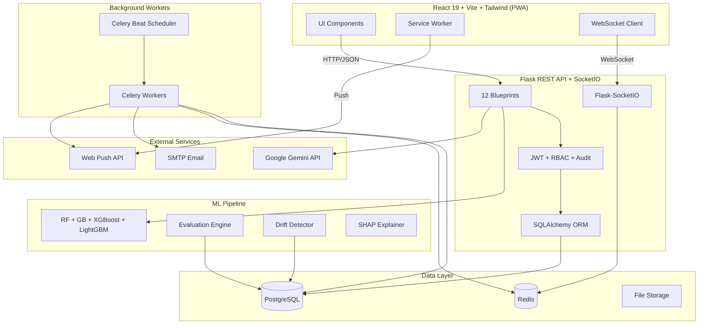
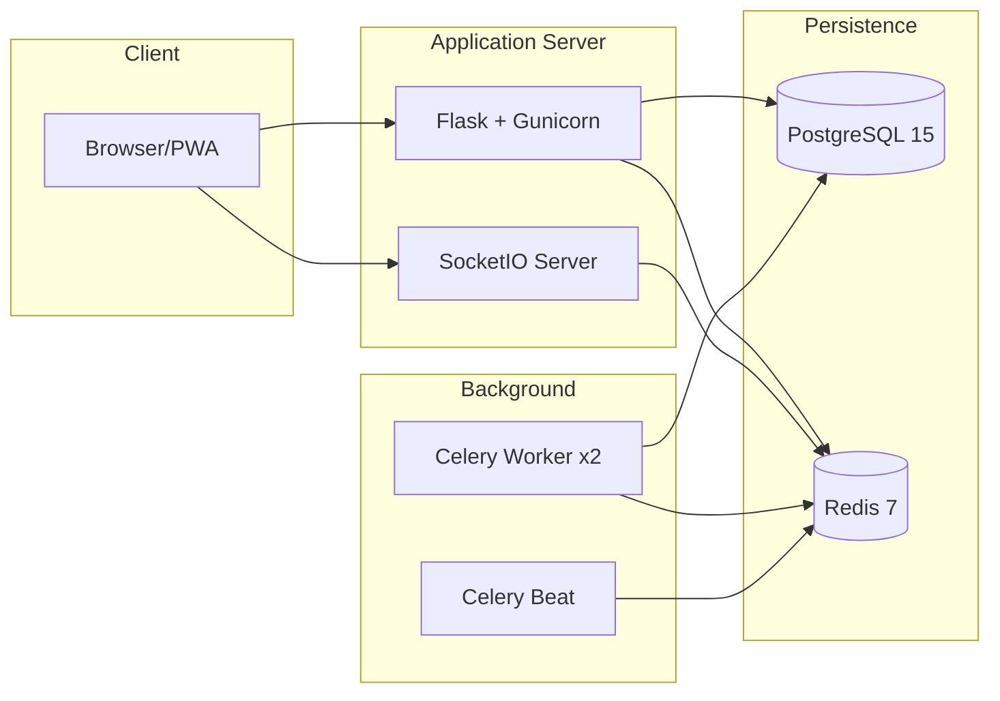
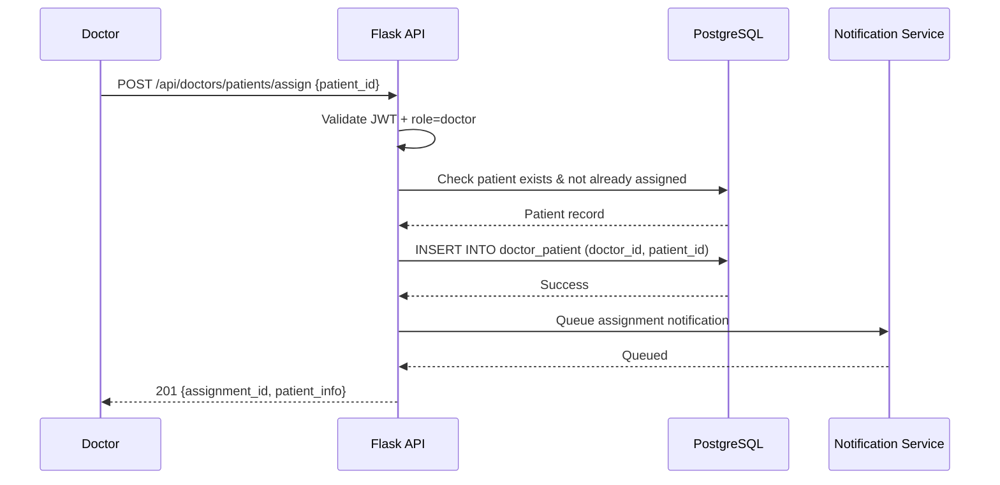
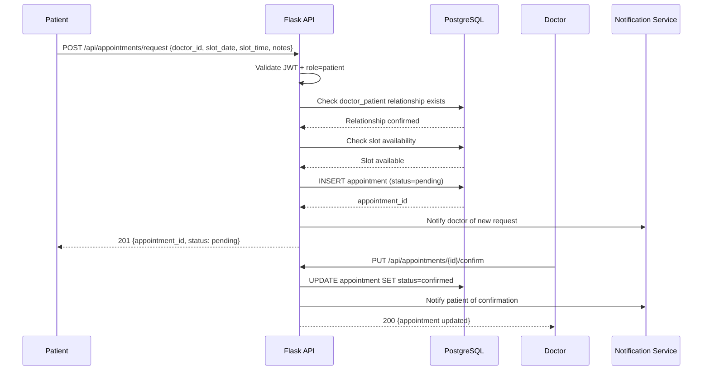
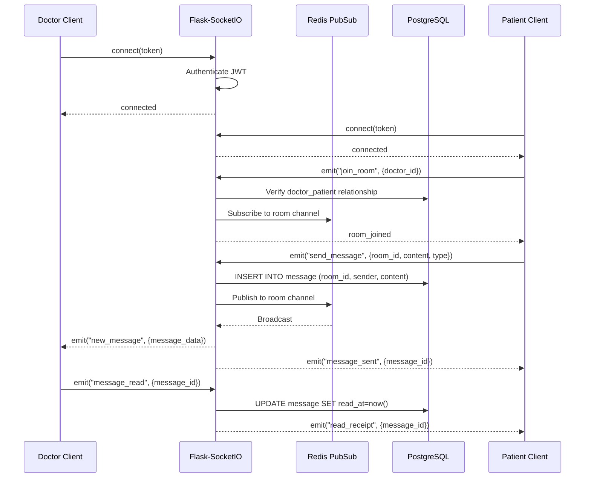
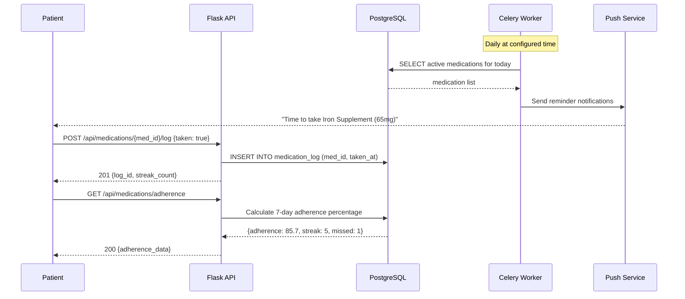

# Design Document: AnemiaCare Production Upgrade

## Overview

The AnemiaCare Production Upgrade transforms the existing anemia detection prototype into a production-grade clinical platform. The current system provides ML-based anemia prediction with basic RBAC, but lacks critical cross-role workflows (doctor-patient relationships, appointments, prescriptions), real-time communication, medication tracking, community features, and production infrastructure (PostgreSQL, WebSocket, task queues).

This upgrade addresses 12 major capability gaps identified during production readiness review. The architecture migrates from SQLite to PostgreSQL with SQLAlchemy ORM, adds Flask-SocketIO for real-time messaging, introduces Celery+Redis for background job scheduling, and expands the frontend with PWA support, dark mode, and accessibility compliance. The ML pipeline gains proper evaluation with real datasets, additional models (XGBoost, LightGBM), and drift detection.

Priority ordering ensures the most visible gaps (doctor-patient workflow, appointments) ship first, followed by medication tracking, ML improvements, real-time messaging, community features, infrastructure upgrades, and frontend polish.

---

## Architecture

### System Architecture (Post-Upgrade)

### Deployment Architecture

---

## Sequence Diagrams

### Doctor-Patient Assignment Flow

### Appointment Booking Flow

### Real-Time Messaging Flow

### Medication Adherence Tracking Flow

---

## Components and Interfaces

### New Backend Blueprints
